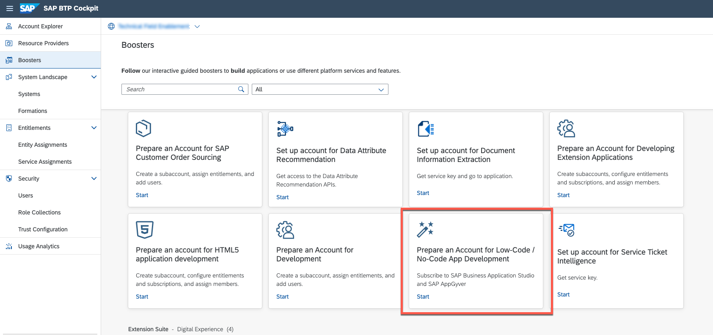

### You can execute a booster to immediately enable your SAP BTP account for SAP AppGyver development.

It helps you add low-code / no-code tools from SAP that accelerate business application development. This booster will guide you through the process of enabling the tools, configuring entitlements, and assigning members on SAP Business Technology Platform. Once the booster completes, your subaccount will be ready for business experts, citizen developers, and even pro coders to easily create or enhance business applications using wizards, templates, graphical editors, forms, and additional graphical tools that require no knowledge of programming.

You can also use the community version at [AppGyver.com](https://appgyver.com) to follow along.

>Note, the Booster is not available yet for the SAP BTP Trial accounts.

