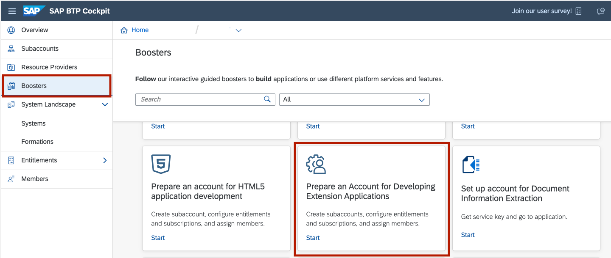

# Setup SAP Business Technology Platform

You will now prepare your SAP Business Technology Platform environment with the help of boosters, configure your entitlements and configure your account for our extension scenario.

## Prepare your SAP Business Technology Platform Account

1. Navigate to *Boosters* 
2. Search for 'Prepare an Account for Developing Extension Applications'

   

3. Click on the tile and chosse the *Start* button to start the creation of your account

   

4. Check if you fulfill all prerequisites and then choose *Next*

   

   - In case you see **WARNING**, it means _some optional services_ are not entitled in your global account. You can create the account, but without missing services
   - In case you see **ERROR**, it means _some mandatory services_ are missing and you need to check your global account entitlements 
   - In case you see **DONE**, it means _all necessary services_ are entitled and you can continue with next step

5. On the next screen you can set up your Subaccount: 
    - Configure the Entitlements
    - Enter Subaccount name - e.g: "Development"
    - You can edit the smaller org name, space name (optional)
6. Click on *Next* to finish

   

7. On the next screen you can add your needed Users:
 - Enter Administor's ID (you can enter IDs of people you would like to have the admin role)
 - Enter developer's ID
8. Click on *Next*

 9. After you reviewed your account click on *Finish* 

## Add Entitlement for SAP HANA Cloud

 1. Now click on your Subaccounts Name to open 

 2. Navigate to *Entitlements* and click on *Configure Entitlements* 

 

 3. Then choose *Add Service Plans*

 4. Search for "HANA" in the pop-up window and select *SAP HANA Cloud*

 5. Click on the checkbox below "Available Plans" for HANA
    

 6. Click on *Add 1 Service Plan* and save

 ## Create HANA Cloud Instance 

This step is required for newly created accounts, e.g. with Boosters where you don't have HANA Cloud instance. In case of existing subaccount with HANA Cloud instance, you can skip this section

1. Open your *Subaccount* and go to the *Space* 
2. Open *SAP HANA Cloud* tab and create new instance
    
    

3. Give an Instance Name and the Password for DBADMIN user

    

4. Choose the Database Memory size
   
   

5. Select who can have access to you SAP HANA database instance (allowed connections) and *Create Instance*
   
   

6. Wait couple of minutes until the HANA Ccloud Instance is created

    
