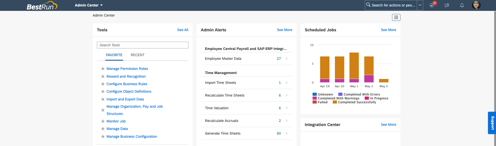
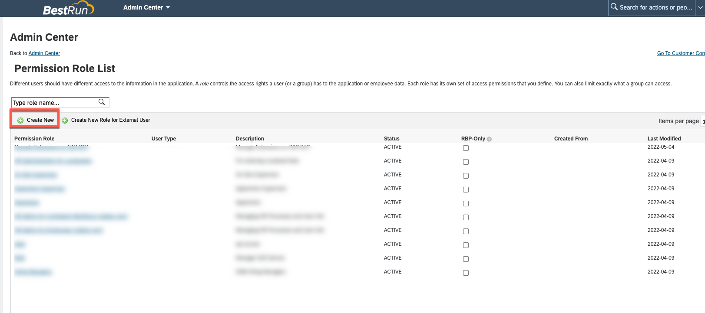
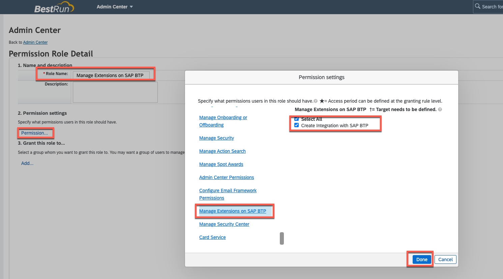
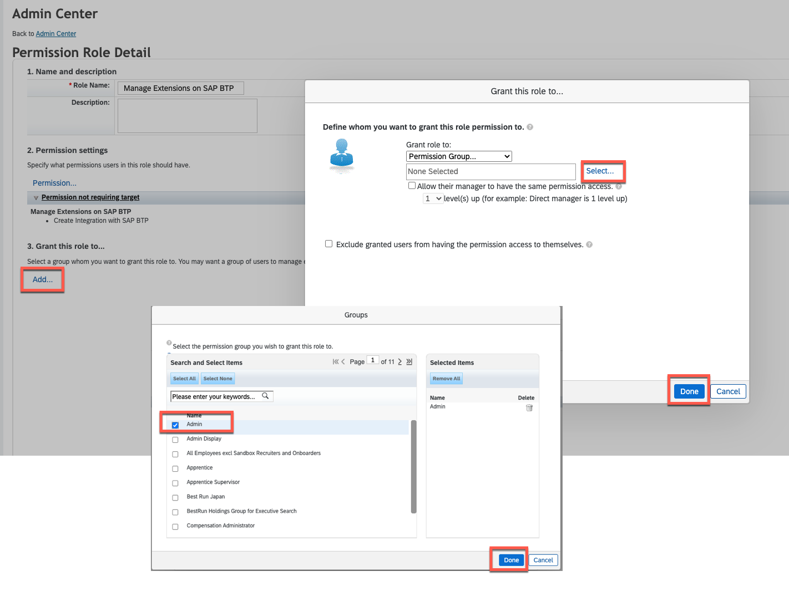
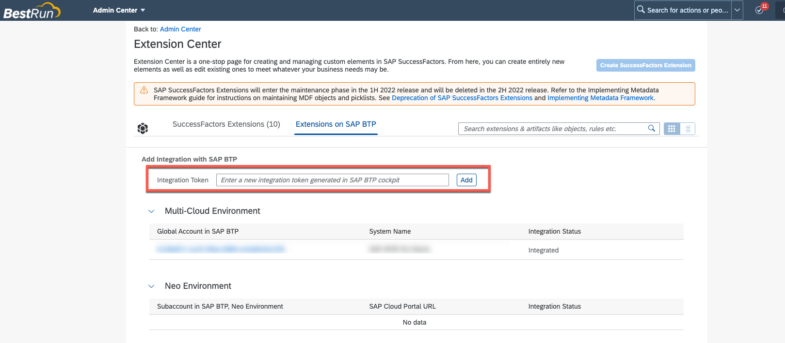

# Setup SAP BTP and SAP SuccessFactors connectivity and extensibility

To connect to a SAP SuccessFactors system we first have to register it on the SAP BTP global account. This is a pre-requisite to adding the SAP SuccessFactors extensibility service

## Add system in SAP BTP cockpit

  1. Create a new SAP SuccessFactors System
     * Go to your SAP BTP Global Account and select Systems
     * Click on Register System
     * Set a system Name - we will need this name in later section.
     * Select SAP SuccessFactors as type
     * Click on Register

     
 
  1. In the Register System pop-up copy the generated token to a local file and close the window. The status of the SAP SuccessFactors system is now pending.

     

## Add generated token to SAP SuccessFactors System

  1. Go to your SAP SuccessFactors Admin Center

     

  2. In order to create Integration with SAP BTP, a permission from the *Manage Extensions on SAP BTP* category is required. In Admin Center search for *Manage Permission Roles*, open it and cretae new permission role.

     

  3. Give a Role name, e.g. "Manage Extensions on SAP BTP" and add the permission **Create Integration with SAP BTP** from category **Manage Extensions on SAP BTP** 

     
   
  4. Grant this role to a Permission Group, e.g. "Admin"

     

  5. Now search in Admin Center *"Extension Center"* and open it. Here you can add the *Integration Token* noted from one of the first steps which was generated in SAP BTP.

     

  5. At your SAP Business Technology Platform account the system should now have the status "Registered"

     

## Add Entitlement for SAP SuccessFactors Extensibility

  1. Now click on your Subaccounts Name to open 

  1. Navigate to *Entitlements* and click on *Configure Entitlements* 

     

  1. Then choose *Add Service Plans*

     

  1. Search for "SuccessFactors" in the pop-up window and select *SAP SuccessFactors Extensibility*

  1. Select Available Plan "api-access"
    
     

  1. Click on *Add 1 Service Plan* and save
