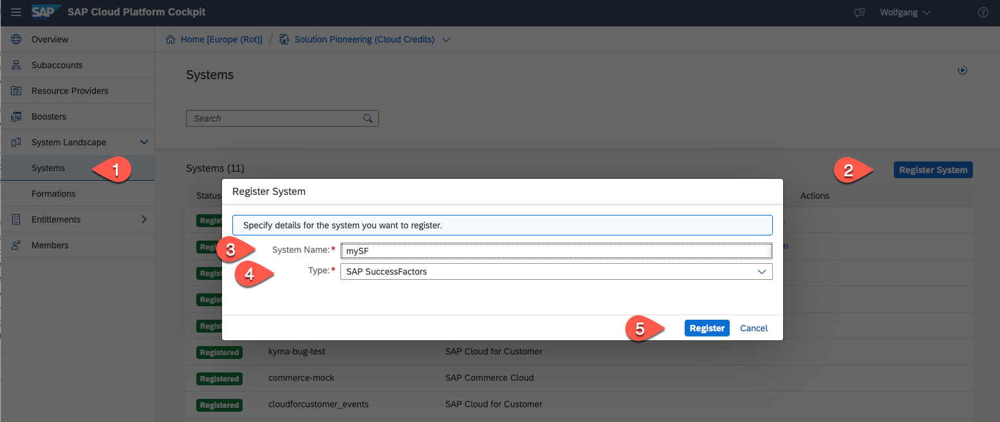
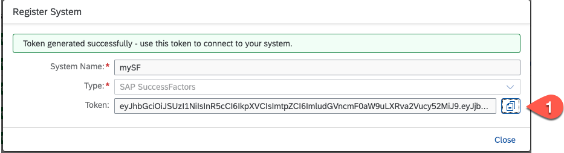
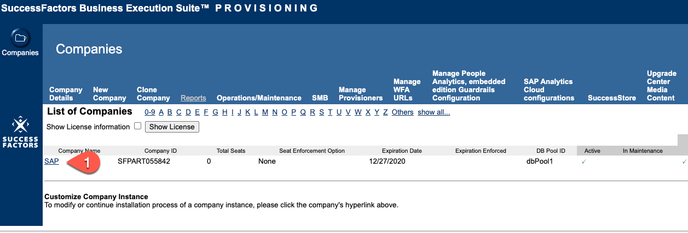
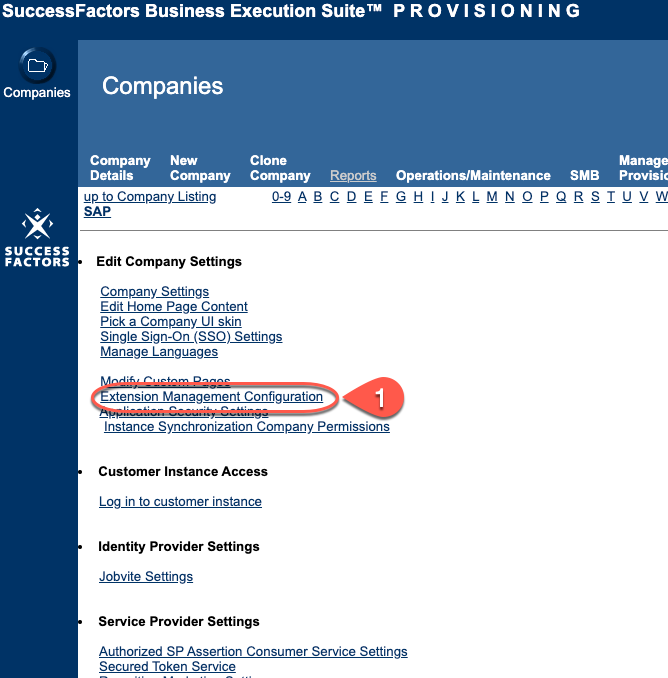
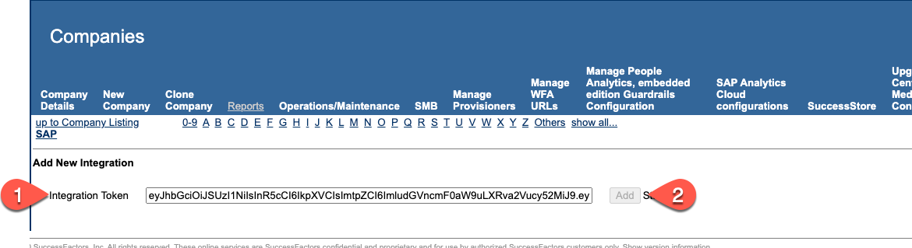
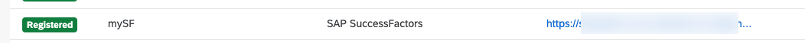
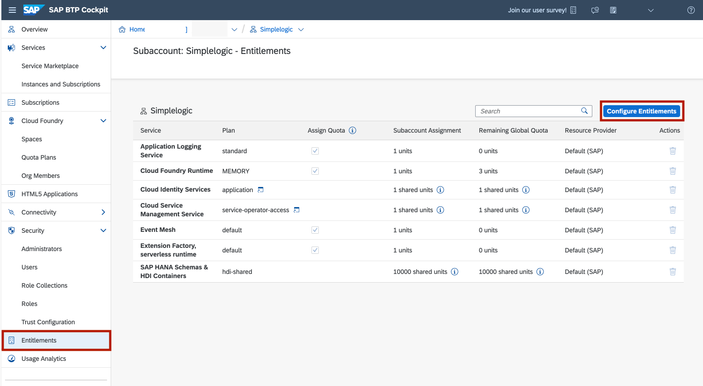
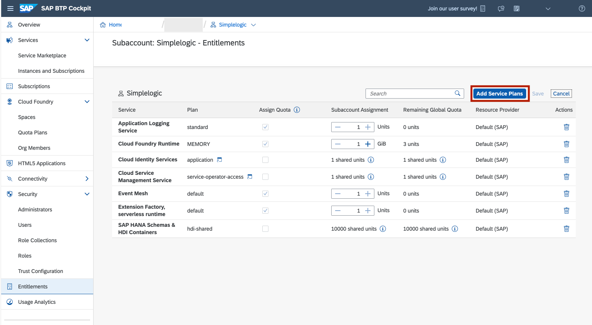
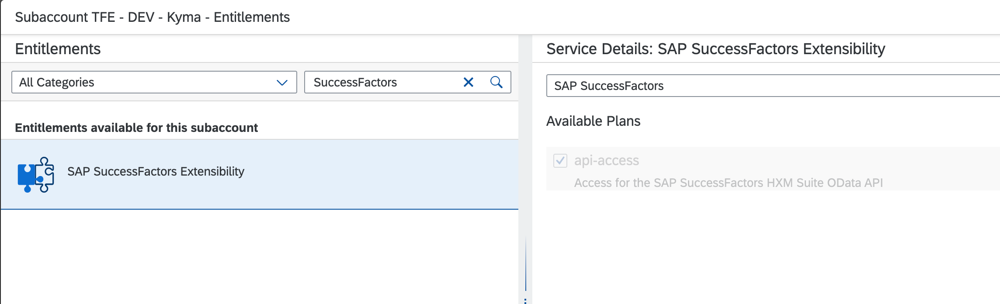

# Setup SAP BTP and SAP SuccessFactors connectivity and extensibility

To connect to a SAP SuccessFactors system we first have to register it on the SAP BTP global account. This is a pre-requisite to adding the SAP SuccessFactors extensibility service

## Add system in SAP BTP cockpit

  1. Create a new SAP SuccessFactors System
     * Go to your SAP BTP Global Account and select Systems
     * Click on Register System
     * Set a system Name - we will need this name in later section.
     * Select SAP SuccessFactors as type
     * Click on Register

     
 
  1. In the Register System pop-up copy the generated token to a local file and close the window. The status of the SAP SuccessFactors system is now pending.

     

  1. Go to your SAP SuccessFactors Provisioning Tool Home Page. Select your company.

     

     * Note that provisioning is only available for SAP employees and partners. Customers should raise an incident against the **LOD-SF-PLT** component requesting support for this step.

  1. In the Edit Company Settings click on Extension Management Configuration

     

  1. In the Add New Integration section insert the token from your SAP Business Technology Platform account and click on add

     

  1. At your SAP Business Technology Platform account the system should now have the status "Registered"

     

## Add Entitlement for SAP SuccessFactors Extensibility

  1. Now click on your Subaccounts Name to open 

  1. Navigate to *Entitlements* and click on *Configure Entitlements* 

     

  1. Then choose *Add Service Plans*

     

  1. Search for "SuccessFactors" in the pop-up window and select *SAP SuccessFactors Extensibility*

  1. Select Available Plan "api-access"
    
     

  1. Click on *Add 1 Service Plan* and save
