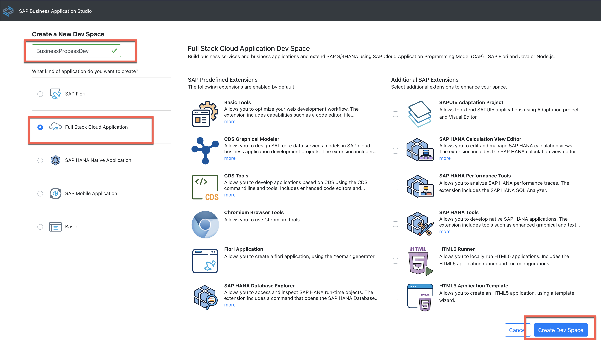

# Configure SAP Business Application Studio

In this how to guide, you will create a developers space in SAP Business Application Studio for this project.

### Create a new application in SAP Business Application Studio

1.	Make sure you have opened your *SAP BTP Account* and navigate to your *Subaccount* 
   
2.	Open the menu *Services* and navigate to *Instances and Subscriptions*
   
3.	Choose "SAP Business Application Studio" under the *Subscriptions* tab and click on the icon to open the application
     
     
 
4.	 After opening the home sceen of SAP Business Application Studio, click the button *Create Dev Space*

     
 
5.	On the next screen you will create the new Dev Sapce. For this enter a Dev space name e.g 'BusinessProcess', select the type *Full Stack Cloud Application*.
    Don´t forget to click on the button *Create Dev Space*

      
      
 
6.	Your Dev Space is now being created. As soon as the Dev Space is running you can click on your Dev Spaces name to  access