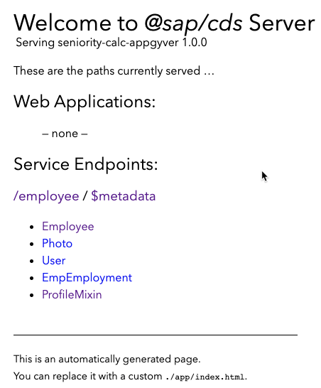

## Deploy CAP service to Cloud Foundry and HANA Cloud

Follow the instructions for the [original mission](https://github.com/SAP-samples/successfactors-extension-calculate-employee-seniority/tree/mission/05-DeployCAPApplicationToCloudFoundryAndHANACloud) but note that the application id for this mission is ```seniority-calc-appgyver```

  - If you previously deployed the ```seniority-calc-srv``` application from the main mission branch, you should stop it before proceeding. You can do this from the applications section of your Cloud Foundry space
  - As a final step before you access the entities, add a sample exception record so EmployeeProfile returns some data. You can use the POST request in [request.http](../../fsf-mobile-appgyver/srv/request.http#L7) in conjunction with ```cds watch``` from SAP Business Application Studio

### Explanation of services

The following services endpoints should be available upon deployment of the CAP project:

  
    
1. Employee - This is the locally managed entity on SAP BTP that the original extension writes to, and that we will use to make updates via SAP AppGyver. An event handler for ```srv.after("UPDATE")``` has been added to recalculate seniority and write it back to Employee Central
2. Photo - Remote entity on SAP SuccessFactors; basic service implementation to apply photoType filter and OData v2
3. User - Remote entity on SAP SuccessFactors; no service implementation for this entity
4. EmpEmployment - Remote entity on SAP SuccessFactors; basic service implementation for OData v2
5. EmployeeProfile (previously called ProfileMixin above) - View combining fields from the 4 entities above; custom service implementation for READ
    - Returns all records of status = "EXCEPTION"
    - Returns a single record when accessed by key, such as /employee/EmployeeProfile('15dae86b-1537-4d3d-a340-1d6ac4e4f5c7')

### Changes to entity metadata

Metadata for the Employee entity has been updated as follows:

```
<EntityType Name="Employee">
    <Key>
        <PropertyRef Name="ID"/>
    </Key>
    <Property Name="createdAt" Type="Edm.DateTimeOffset" Precision="7"/>
    <Property Name="createdBy" Type="Edm.String" MaxLength="255"/>
    <Property Name="modifiedAt" Type="Edm.DateTimeOffset" Precision="7"/>
    <Property Name="modifiedBy" Type="Edm.String" MaxLength="255"/>
    <Property Name="ID" Type="Edm.String" Nullable="false"/>
    <Property Name="userId" Type="Edm.String" MaxLength="64"/>
    <Property Name="hireDate" Type="Edm.DateTimeOffset" Precision="7"/>
    <Property Name="originalStartDate" Type="Edm.DateTimeOffset" Precision="7"/>
    <Property Name="status" Type="Edm.String" MaxLength="1024"/>
    <Property Name="seniority" Type="Edm.Decimal" Scale="variable"/>
    <Property Name="terminationDate" Type="Edm.DateTimeOffset" Precision="7"/>
</EntityType>
```

Note that at the time of writing, SAP AppGyver OData understands Edm.DateTimeOffset (e.g. CAP type Timestamp) but not Edm.Date (e.g. CAP type Date). ID was also changed to Edm.String from Edm.UUID

Metadata for the EmployeeProfile (previously called ProfileMixin) entity as follows:

```
<EntityType Name="EmployeeProfile">
    <Key>
        <PropertyRef Name="ID"/>
    </Key>
    <Property Name="ID" Type="Edm.String" Nullable="false"/>
    <Property Name="userId" Type="Edm.String" MaxLength="100"/>
    <Property Name="photo" Type="Edm.Binary"/>
    <Property Name="hireDate" Type="Edm.DateTimeOffset" Precision="7"/>
    <Property Name="originalStartDate" Type="Edm.DateTimeOffset" Precision="7"/>
    <Property Name="status" Type="Edm.String" MaxLength="1024"/>
    <Property Name="terminationDate" Type="Edm.DateTimeOffset" Precision="7"/>
    <Property Name="fullName" Type="Edm.String"/>
    <Property Name="lastTerminationDate" Type="Edm.DateTimeOffset" Precision="7"/>
    <Property Name="seniorityDate" Type="Edm.DateTimeOffset" Precision="7"/>
</EntityType>
```

Note that the type for photo is Edm.Binary, which is passed through from the underlying SAP SuccessFactors data type. Some character conversion of the binary string occurs at the CAP service level, and we account for this in an SAP AppGyver formula. Further explanation of the newly added code is covered in the [final section of the mission](../08-CustomizeTheApplicationAndServicesForYourOwnScenario).
