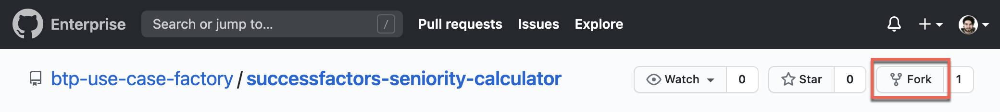
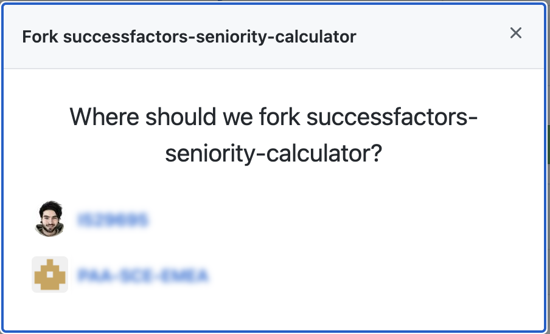

# Clone the Repository and adapt the configuration to your enviroment

In this how to guide, you will clone an existing CAP application to your SAP Business Application Studio dev space, deploy and test your application.

1. Go to <https://github.com/SAP-samples/successfactors-extension-calculate-employee-seniority> and fork the repository so that you have the source code and can further on work and change the code. (For instance, in one of the subsequent steps you can customize the business rules to your own requirements)

    

  > the screenshot was created when the repository was still private. that's why the fork button appears to be disabled. 

2. Choose your user as destination for the fork. 

    


    You should now have the following repository: https://github.com/**YourUser**/successfactors-extension-calculate-employee-seniority 

3.	Choose *Terminal -> New Terminal* in the menu on the top of your screen.

    
 
4. In the opened terminal go to projects folder with executing
   
   ``` 
   cd projects
   ``` 

5. Clone your forked sample GitHub repository for this mission. 

    ```
    git clone https://github.com/SAP-samples/YourUser/successfactors-extension-calculate-employee-seniority
    ```

    > IMPORTANT: Replace **YourUser** with your actual username. 

6.	Click on *File* in the menu on the top and choose *Open Workspace* in the drop down.

    
 
7.	Open the project by selecting projects -> successfactors-extension-calculate-employee-seniority and click on *Open*

8. After the project has been cloned and opened successfully, you need to adapt the configuration of the project to your environment. For this, you have to enter the name of the registered SAP SuccessFactors System from the step [Setup SAP BTP and SAP SuccessFactors connectivity and extensibility](../02-SetupSAPBTPAndSAPSuccessFactorsConnectivityAndExtensibility) (in this case *mySF*) into two files:

*mta.yaml*:
```yaml
  ...
  - name: seniority-calc-sfsf-service
    #type: org.cloudfoundry.managed-service
    type: org.cloudfoundry.existing-service
    parameters:
      service: sap-successfactors-extensibility
      service-plan: api-access
      config:
        systemName: <NAME-OF-REGISTERED-SFSF-SYSTEM>
        technicalUser: sfadmin
```

*em.json*:
```json
{
  "emname": "seniority_calculator",
  "namespace": "sap/successfactors/<NAME-OF-REGISTERED-SFSF-SYSTEM>",
  "options": {
    "management": true,
  ...
```

9. Change the [payload URI](https://github.com/SAP-samples/successfactors-extension-calculate-employee-seniority/blob/main/srv/emp-service.js#L72) in *emp-service.js* . It depends on the SF Instance.


```js
    const getSeniorityPayload = (userId, years, months, days, totalDays) => {
        return {
            "__metadata": {
                "uri": `https://<sf-host>:<sf-port>/odata/v2/EmpEmployment(personIdExternal='${userId}',userId='${userId}')`,
                "type": "SFOData.EmpEmployment"
            },
```

10. Modify the topic name in *emp-service.js* to include the name of the SFSF system registered.


```js
messaging.on(
    "sap/successfactors/SFPART057671/isc/contractchange",
    ...
)
```

11. Change the [redirect URL](https://github.com/SAP-samples/successfactors-extension-calculate-employee-seniority/blob/main/xs-security.json#L9) in *xs-security.json*, based on your BAS URL.

```json
{
  "xsappname": "seniority-calc",
  "tenant-mode": "dedicated",
  "scopes": [],
  "attributes": [],
  "role-templates": [],
  "oauth2-configuration": {
    "redirect-uris": [
    "https://*.<region>.applicationstudio.cloud.sap/"
  ]
}
}
```
