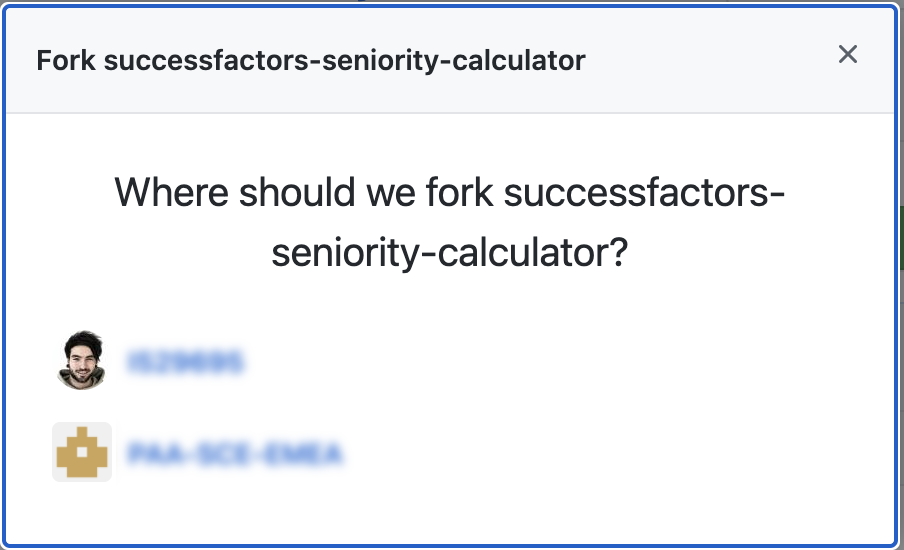

# Clone the Repository and adapt the configuration to your enviroment

In this how to guide, you will clone an existing CAP application to your SAP Business Application Studio dev space, deploy and test your application.

1. Go to <https://github.com/SAP-samples/successfactors-extension-calculate-employee-seniority> and fork the repository so that you have the source code and can further on work and change the code. (For instance, in one of the subsequent steps you can customize the business rules to your own requirements)

    

    > the screenshot was created when the repository was still private. that's why the fork button appears to be disabled.

    > **Important:**
    When forking, uncheck the checkbox that says 'copy the main branch only' (see below), to make sure you also have the content of the AppGyver Branches ***(these e.g. contain the complete code for the end-to-end scenario)***
    

2. Choose your user as destination for the fork. 

    


    You should now have the following repository: https://github.com/**YourUser**/successfactors-extension-calculate-employee-seniority 

3.	Choose *Terminal -> New Terminal* in the menu on the top of your screen.

    
 
4. In the opened terminal go to projects folder with executing
   
   ``` 
   cd projects
   ``` 

5. Clone your forked sample GitHub repository for this mission. 

    ```
    git clone https://github.com/SAP-samples/YourUser/successfactors-extension-calculate-employee-seniority
    ```

    > IMPORTANT: Replace **YourUser** with your actual username. 

6.	Click on *File* in the menu on the top and choose *Open Workspace* in the drop down.

    
 
7.	Open the project by selecting projects -> successfactors-extension-calculate-employee-seniority and click on *Open*

8. Here the namespace of SAP Event Mesh is **sap/successfactors/SFP*******671**. Namespace can be changed in **em.json**

_em.json:_
```js
{
  "emname": "seniority_calculator",
  "namespace": "sap/successfactors/<NAME-OF-MOCK-SYSTEM>",
  "options": {
    "management": true,
  ...
```

9. Modify the topic name in *srv/emp-service.js* to include the name of the Mock system.


```js
messaging.on(
    "sap/successfactors/SFPART057671/isc/contractchange",
    ...
)
```

10. Change the [redirect URL](https://github.com/SAP-samples/successfactors-extension-calculate-employee-seniority/blob/main/xs-security.json#L9) in *xs-security.json*, based on your BAS URL.

```json
{
  "xsappname": "seniority-calc",
  "tenant-mode": "dedicated",
  "scopes": [],
  "attributes": [],
  "role-templates": [],
  "oauth2-configuration": {
    "redirect-uris": [
    "https://*.<region>.applicationstudio.cloud.sap/"
  ]
}
}
```
