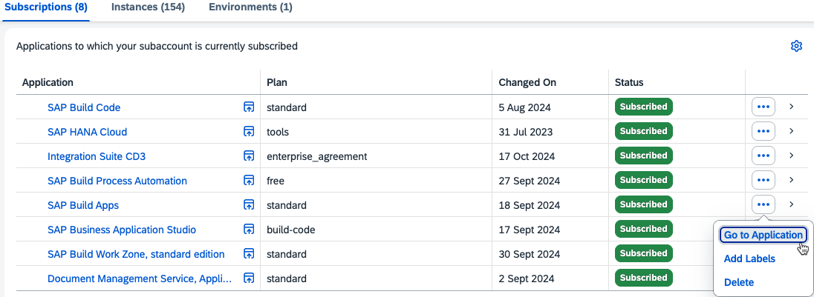
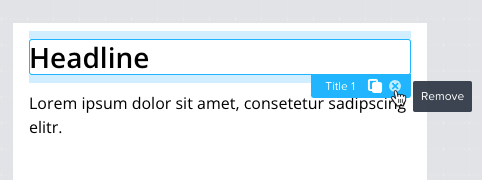
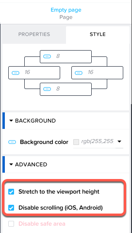
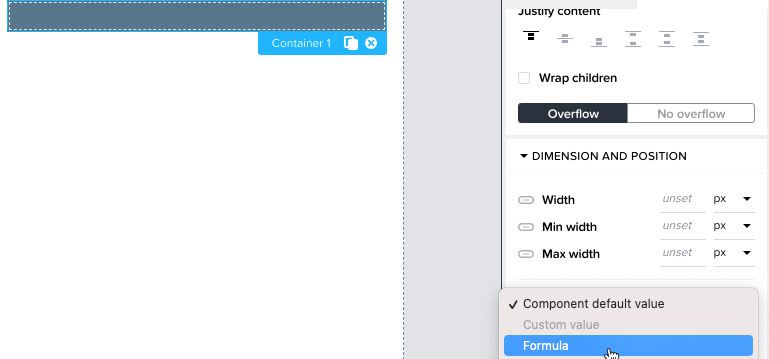
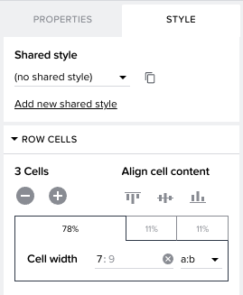
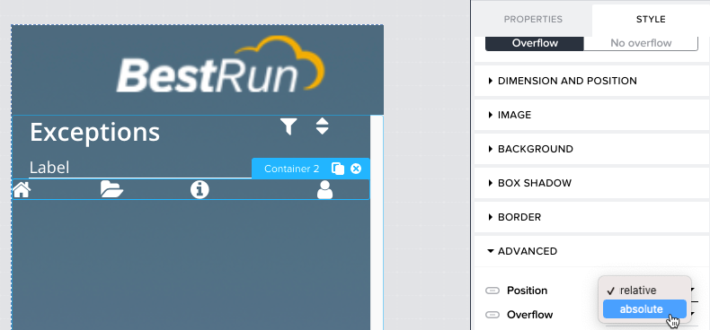
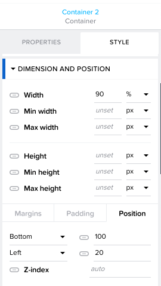
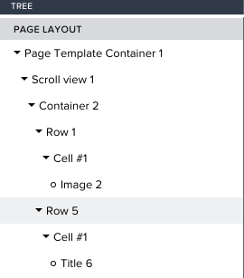
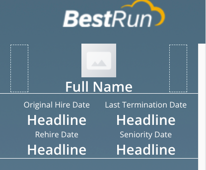
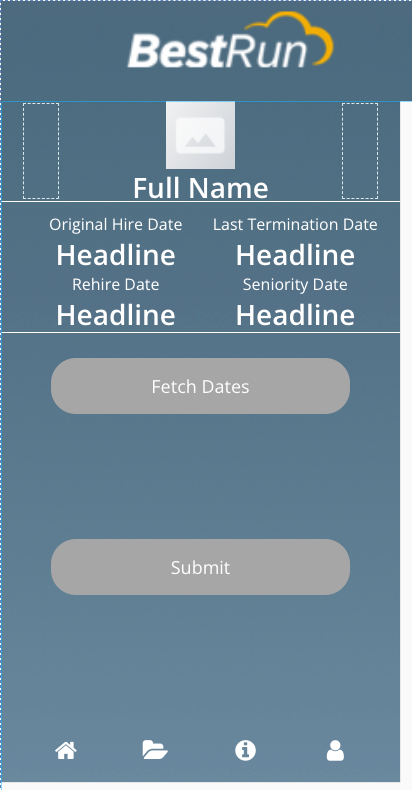

## Create an SAP Build Apps project on SAP BTP

In the following steps you will create an app formatted for an iOS form factor. This will highlight the design and technical concepts needed to implement an app that uses SAP BTP and SAP SuccessFactors in seamless fashion.

Start by accessing SAP Build Apps in the BTP cockpit:

  

### Page 1 - Exception List

This first page contains an image list that we will eventually connect to a remote SAP SuccessFactors system, using CAP services as the entry point. You will add some components that we don't hook up in this mission, but references are provided whenever possible to supplemental resources you can use to implement in your own scenario.

1. Clean up the canvas by deleting the components that are placed on the page by default

    

1. Name your page **1. Exception List** in the properties pane, set a description if you want, and save your application

1. Create a full screen background - [video walkthrough](https://docs.appgyver.com/appgyver-academy/tutorials/tutorial-articles/full-screen-background)
    - Under the style tab, set the page layout to “stretch to the viewport height” and “disable scroll”

      

    - Add a container component, give it a [background image](./images/4BestRun.png) and set its height to the viewport height system variable with the formula ```systemVars.dimensions.viewport.height```. Repeat this with the width property and the formula ```systemVars.dimensions.viewport.width```

      

    - You now want to fix the padding problem between the container and the page. This is controlled by the $paddingPageVertical and $paddingPageHorizontal theme settings. Click on **Theme** > **Layout** and set both values to 0.
    - While you are there, set the $colorContentPrimary value to #ffffff to accommodate the blue background. Save the app and return to **1. Exception Details**
    - Inside the container, add a scroll view, and set its width to the same formula. For height, use the following formula: ```systemVars.dimensions.viewport.height - 100``` 
    - Set the Top position to 100 under Style > Position

1. Add a header row to the canvas from the **Layout** section
    - Set the row to have 3 cells and set the first cell to have a 7:9 ratio. Set the width to 90% and Center align self. You can also set each child cell in the row to center the content inside it.

      

    - Add a Title component to the first cell and add an icon component to the second and third cells. Set the Typography > Text color to $colorContentPrimary
    - Change the Title component text to **Exceptions** 
    - Select the filter and sort icons respectively so that your app looks like this:

      

1. Optionally, implement a search bar using this [excellent reference]([https://docs.appgyver.com/appgyver-academy/tutorials/power-ups/power-up-search-bar-with-sugggestions](https://www.youtube.com/watch?v=lEH6K6Bw_2U))

1. Add an image list component to hold the core data from SAP SuccessFactors. Set the Top margin to 10px, the width to 90%, and Center align self
    - The image list is a custom component comprised of 4 cells, an embedded image component, and some texts. Custom components can be edited by double-clicking them from the canvas

1. Create a navigation bar
    - Add a container to the canvas. Make sure it isn't nested inside of the scroll view
    - Add a row component into the container by dragging it into the tree view
    - Make 4 cells in the row and center align the content of each

        

    - Drag an icon into each cell, set the font color to #ffffff, and select a different icon for each cell
1. Anchor the navigation bar to the bottom of the page
    - Select the **Container 2** component from the Tree view
    - Under Style > Advanced set the position to Absolute

        

    - Under Style, set the width to 90%, the Bottom position to 20 and the left position to 20

        

Now save the application and move on to create the 2nd page.

### Page 2 - Exception Details

The second page will contain the details for a specific employee. Some data will be populated from the extension database, running on SAP HANA Cloud, and other details such as the employee's past termination date and system configured seniority date, will be retrieved from SAP SuccessFactors on demand. These pieces of info will equip the HR business partner with the details they need to correct the exception.

1. Click the page name link in the top left to return to the page gallery, where you can add a new page. Do so, and name it **2. Exception Details**

1. Remove the initial components from this page as well, like before

1. Go back to **1. Exception List**, select the top level container, rename it to Page Template Container, and click **Convert to New Component**

    

1. Go to **2. Exception Details**, select **BY ME** in the component list, and add **Page Template Container** to the new page
    - Set the background image again
    - Double click to edit the custom component details and delete the image list
    - Add a new container to the top of the Scroll view
    - Move Row 1 into it and reduce the number of cells to 1. Accept any warnings. Set the Width to 90% and the Height to 90px
    - Duplicate Row 1 so that the 2 rows are on top of each other
    - Add an Image component to the container and set the Width to 100%, the Height to 100%, and align it to center
    - Add a Title component below the image and set the content to Full Name. The tree view should look similar to this:

        

1. Create fields and headers to contain dates
    - Before exiting the template, you can break it apart into original components again if desired, to make it easier to customize. Then, double click outside the page to exit.

        

    - Add a list divider under the scroll view container
    - Add another container and add 2 rows inside of it. Set the width of the container to 90%, the left and top margins to 10 and align self to center
    - In each cell, add a paragraph component and a title component beneath. You can center the contents of both components by setting the Layout of the cell, as above
    - The paragraphs will contain our column names. Set them to **Original Hire Date**, **Last Termination Date**, **Rehire Date**, and **Seniority Date**
    - Finish this section with another list divider. Your app should now look something like this:

        

1. Create button to fetch missing information from SAP SuccessFactors
    - When the app is finished, the HR business partner will be able to fetch the last termination date and current seniority date from the backend. Add a button to the canvas and call it **Fetch Dates**
    - Set the alignment and justify to middle, the width to 75%, the top margin to 25, and the background color to something you like, such as #a6a6a6
    - Note that you can even round the edges of buttons by setting the $buttonBorderRadius theme variable to a number like 25
1. Create submit button
    - Duplicate the first button, change the name to **Submit**, and increase the top margin to 125

        

Congratulations! You have now completed the design of your SAP Build Apps mobile application.

