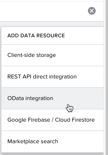
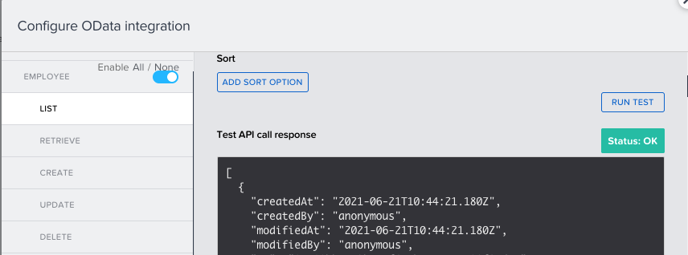
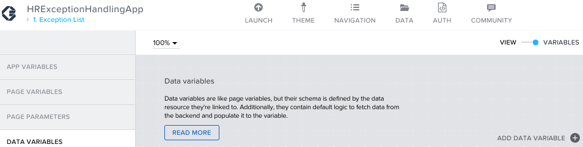
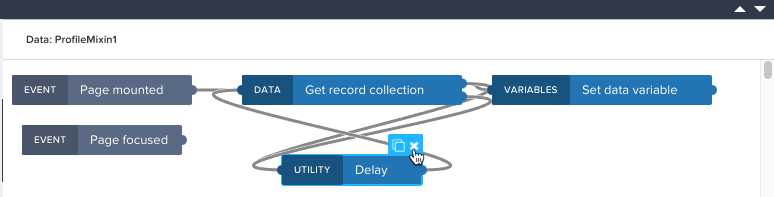
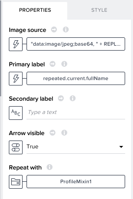
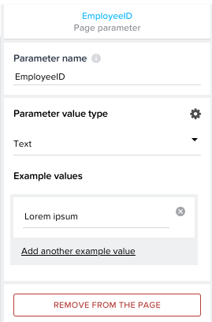
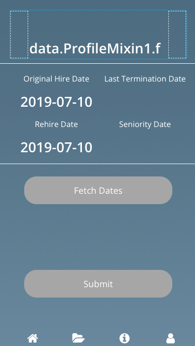

## Connect SAP AppGyver to the backend via OData

In this section, we'll hook up the application to the CAP OData endpoints you deployed in the previous sections. This will allow us to preview the app with real data from SAP BTP and SAP SuccessFactors. We will do this by mapping in the OData service and any entities we want to access. Then, we populate the data into the app components through the use of data variables.

### Create data resources

1. Click the data tab at the top of the application
1. Click the plus sign and add an OData integration

    

1. Enter the Base API URL from the CAP service you deployed earlier, for example: https://btp-subaccount-seniority-calc-appgyver-srv.cfapps.eu10.hana.ondemand.com/employee
1. Click verify, and enable the **Employee** and **EmployeeProfile** (previously called ProfileMixin) entities. You can run a test from the individual methods, such as List, Retrieve, etc.

    

1. Click **Save Data Resources**

### Create data variables and mappings for 1. Exception List

1. Access the **1. Exception List** and click on Variables > Data Variables
    - Add a data variable from the EmployeeProfile entity. Leave the default settings as we want this to return the entire list of exceptions from the CAP service

        

    - Click the **Show logic for 1. Exception List** link at the bottom to expand the logic modeler
    - By default, the data will be refreshed every 5 seconds. Remove the delay utility, as we don't need to continuously hit the backend. Save the app.

        

1. Click back to the **View** option and select the Image list item component. Delete the secondary label text from the properties panel
1. Click the icon to the left of image source, select formula, and enter the following text and click save:

    ```"data:image/jpeg;base64, " + REPLACE_ALL(REPLACE_ALL(REPLACE_ALL(repeated.current.photo,"\r\n",""),"_", "/"), "-", "+")```

    Note: You can ignore the errors related to the schema, and we will resolve the reference to ```repeated``` in the next step.

1. Set the primary label to be a formula and enter the value ```repeated.current.defaultFullName```
1. Finally, click the box to the left of **Repeat with** and select **Data and Variables** > **Data Variable**
1. Set the value to **EmployeeProfile** and save.

    

### Create data variables and mappings for 2. Exception Details

1. Access the **2. Exception Details** page and click on Variables > Data Variables
    - Add a data variable from the EmployeeProfile entry and set the type to **Single data record**
    - Add another data variable from the Employee entry and set the type to **Single data record**
1. Click on Page Parameters so we can add a variable that will be passed by the click event on the first page, when an employee record is selected
    - Add parameter, change the name to EmployeeID and Save

        

1. Return to data variables, select **Employee1**, and click the X next to Identifier
    - Select **Object with properties** > Click the button under ID > Data and Variables > Page parameter
    - Select the EmployeeID parameter you just created and save all the way out
    - Repeat this process for the EmployeeProfile1 data variable and save
1. Click on View, and assign the image at the top a similar formula as in the previous step:

    ```"data:image/jpeg;base64, " + REPLACE_ALL(REPLACE_ALL(REPLACE_ALL(data.EmployeeProfile1.photo, "\r\n", ""),"_", "/"), "-", "+")```

1. Set the content of the the Full name field to a formula with the value ```data.EmployeeProfile1.defaultFullName```
1. Set the content of the Headline field under Original Hire Date to ```SUBSTRING(data.Employee1.originalStartDate, 0, 10)```
1. Set the content of the Headline field under Rehire Date to ```SUBSTRING(data.Employee1.hireDate, 0, 10)```
1. Delete the content from the 2 headline components under Last Termination Date and Seniority Date. We will configure those to dynamically populate in the next section.

Your app should look something like this and you can proceed to the next step.

  
