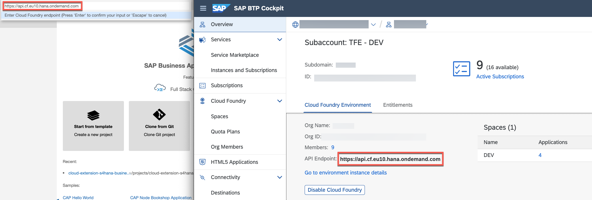

# Deploy CAP service to Cloud Foundry and HANA Cloud

In this how to guide, you will deploy the CAP Application with all its bound services as a Multi Target Application (MTA) from SAP Business Application Studio to Cloud Foundry and HANA Cloud.

1. Logon to the SAP BTP, Cloud Foundry Runtime. 

    - Click on **View > Find Command** in the menu on the top.
   
      
    - Search for **Login to Cloud Foundry** and press **Enter** to confirm.
      

    - Copy & Paste the API Endpoint of your subaccount from the SAP BTP Cockpit. 
      
 
    - Follow the process by entering the credentials of your SAP BTP account and by selecting the Cloud Foundry org and space you want to deploy the application to.

2. Build the Multi-Target Application Archive (MTA Archive) by executing the following command in the root directory of your project in the terminal:

    ```
    mbt build
    ```

3. Deploy the application to SAP BTP, Cloud Foundry Runtime by executing the following command in the root directory of your project in the terminal:

    ```
    cf deploy mta_archives/seniority-calc_1.0.0.mtar
    ```

    This will trigger the deployment to SAP BTP, Cloud Foundry Runtime including the creation of the necessary service instances and service bindings to the corresponding apps.

## Redeployment
If you want to redeploy without undeploying the running CAP Application, you need to change a few services in the ```mta.yaml``` from ```managed-service``` to ```existing-service```. For this, adjust the marked lines highlighted [here](https://github.com/SAP-samples/successfactors-extension-calculate-employee-seniority/blob/main/mta.yaml#L49-L50) and [here](https://github.com/SAP-samples/successfactors-extension-calculate-employee-seniority/blob/main/mta.yaml#L61-L62) that it looks like the following:

```yaml
  - name: seniority-calc-em
    #type: org.cloudfoundry.managed-service
    type: org.cloudfoundry.existing-service
    
    ...

  - name: seniority-calc-sfsf-service
    #type: org.cloudfoundry.managed-service
    type: org.cloudfoundry.existing-service
```
