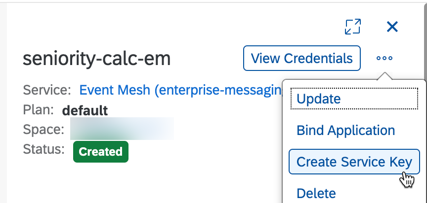
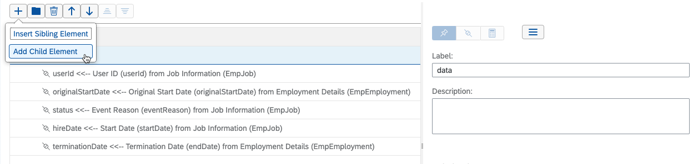

# Configure events on SAP SuccessFactors

 To publish events to the SAP Event Mesh, you will have to setup the SuccessFactors system.

 - [Setting Outbound OAuth Configuration](#setting-outbound-oauth-configuration)
 - [Creating Outbound REST Destination](#creating-outbound-rest-destination)
 - [Defining Integration Center Jobs](#defining-integration-center-jobs)
 - [Configuring flows for Intelligent Service Events](#configuring-flows-for-intelligent-service-events)

## Setting Outbound OAuth Configuration

In this step, login to the SAP SuccessFactors instance as an administrator and register an Outbound OAuth configuration in SAP Successfactors Security Center.

 1. Go to Admin Center  > Security Center or search for Security Center in the search bar. Click on OAuth Configurations

   

 2. Click Add.

 3. Fill in the required fields - Configuration Name, Token URL, Token Method, OAuth Type, Grant Type, Client ID, Client Secret. The Client ID, Client Secret, Token URL details are taken from the service key of the event mesh service instance that you need to create in SAP BTP cockpit (see the steps 4 and 5)

 4. Create a service key for the Event Mesh instance to use when you integrate with SAP SuccessFactors. No paramters are required.

 

 5. Note down the clientid, clientsecret, and tokenendpoint values from the service key to use later.

 

 6. Add Custom Header Parameters  > Add New Row with ```Key = x-qos``` and ```Value = 1``` 
 and click **Save** to complete the process.

   

## Creating Outbound REST Destination

 1. Click **Destination Settings** from the same Security Center screen to configure a REST destination for use in the Integration Center

 2. Click **Add** and give the destination a name. Change the Type to REST.

 3. Enter the Endpoint URL for your Event Mesh namespace and topic that you configured in Step 3

    - The REST API URL is the base URL of the queue which can be retrieved from the Event Mesh service key and contains **pubsub** in the hostname plus the namespace and topic (e.g. https://enterprise-messaging-pubsub.cfapps.eu10.hana.ondemand.com/messagingrest/v1/topics/topicName/messages)
    - The **topicName** must be double encoded. For example, if your topic name is sfsf/topic/sfmessage, then your final URL would be:

      https://enterprise-messaging-pubsub.cfapps.eu10.hana.ondemand.com/messagingrest/v1/topics/sfsf%252Ftopic%252Fsfmessage/messages

    

  4. Click **Save** to finish the destination config

## Defining Integration Center Jobs

You can create an integration from a starting entity and add data from other entities by navigating via data model relationships to fields in related entities. The following steps describe how to create a new integration from a starting entity. The outbound integration specifies the endpoint to which a message should be sent along with the content of the message.

  1. Go to **Admin Center** > **Integration Center** or search for **Integration Center** in the search bar.

  2. Click on **My Integrations** to create a new integration

  3. Click **Create** > **More Integration Types**

  4. Select the **Trigger Type**, **Source Type**, **Destination Type**, and **Format** as below and click **Create**

     - Select Trigger Type: Intelligent Services
     - Select Destination Type: REST
     - Select Source Type: SuccessFactors
     - Select Format: JSON

  

  5. Select the event you want to associate the integration job with. These steps will cover the **Employee Hire** event, but you should repeat the steps for the **Employee Rehire** and **Employment Termination** events to fully test the extension.

   You can now add the remaining items as Child elements, as below:

  

  6. Provide a name for the integration and click **Next**

  7. In the **Configure Fields** tab Click the **+** button > Insert Sibling Elements > Set the label to **data**. This is the container object that they payload will be nested under. The SAP Event Mesh expects the payload to be present inside an object called **data**.

     Add the remaining items as Child Elements, as in the image below.

  

  8. Select **User ID** under the Entity Tree View. Click **Change Association to "User ID"**

  

  9. Set the Label to ```userId``` and description, as desired.

  10. Repeat steps 7-8 for the labels **originalStartDate**, **status**, **hireDate**, and **terminationDate** and see below for the mappings to source entities.

  | Field Label         |	SF Entity	                         | Association                     |	Data Type    |
  | ------------------- | ---------------------------------- | ------------------------------- | ------------ |
  | userId              |	Job Information (EmpJob)           | userId                          | Edm.String   |
  | originalStartDate   |	Employment Details (EmpEmployment) | employmentNav/originalStartDate | Edm.DateTime |
  | status              |	Job Information (EmpJob)           | eventReason	                    | Edm.String   |
  | hireDate            |	Job Information (EmpJob)           | startDate                       | Edm.DateTime |
  | terminationDate	    | Employment Details (EmpEmployment) | employmentNav/endDate           | Edm.DateTime |

  11. On the **Destination Settings** tab, select **REST Server Settings from Security Center** and select the **BTP_SENIORITY_CALC** destination you created previously. Click Next.

  

  12. Review the summary, save the integration job, and then click **Go to Intelligent Service Center** to complete the mapping of the integration flow to an intelligent event. You can also use the **Run Now** button to confirm that the job ran as expected. Keep in mind this will push a message into your Event Mesh queue and may result in a new record in the persistence.

  

## Configuring flows for Intelligent Service Events

  1. Select **+ New Flow** from the Employee Hire event. Give the flow a name, such as **Seniority Flow**

  2. Select **Integration** under Custom Activities on the right

  3. Select **Hire Event REST Output** > **Add Integration**

  

  4. By default, the integration flow will be put under On Effective Date. Update this to **When event is published**

  

  **NOTE: don't forget to save the flow before repeating the above process for the rehire and employment termination events**

  
  
