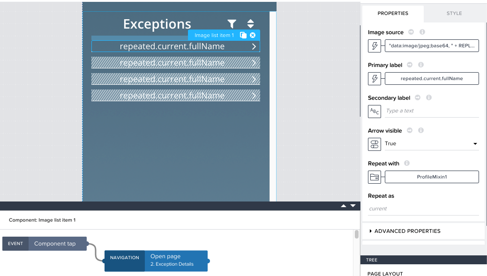
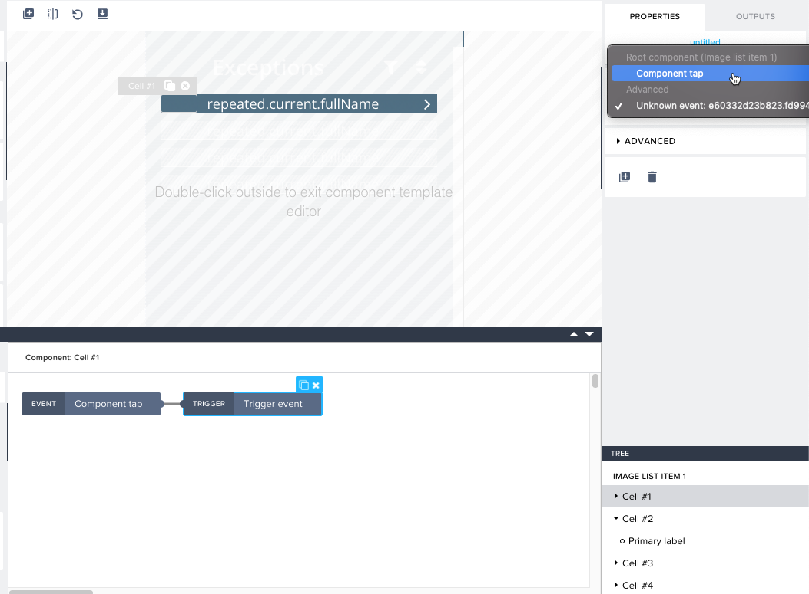
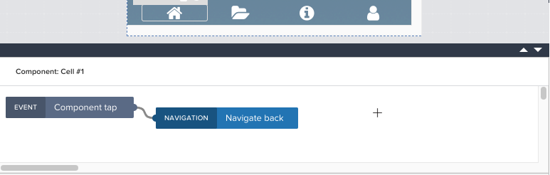
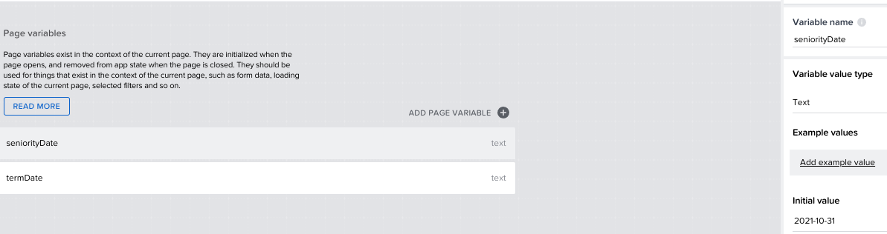
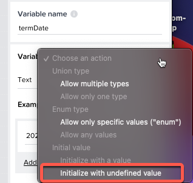
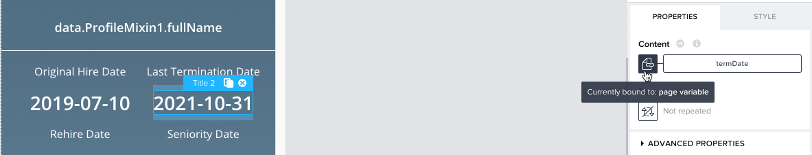
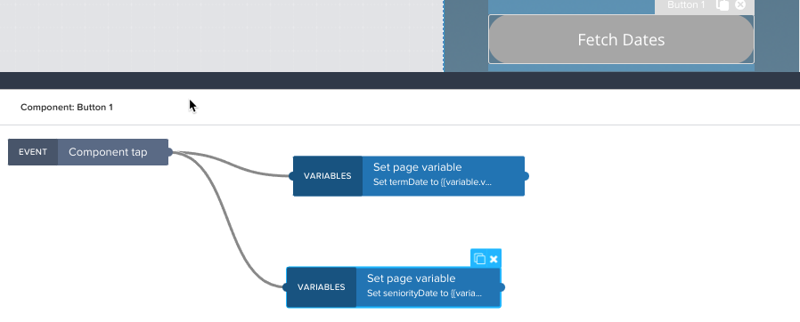
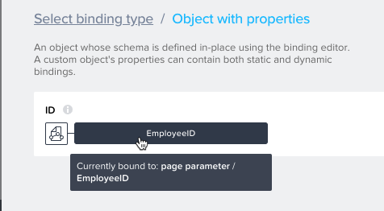
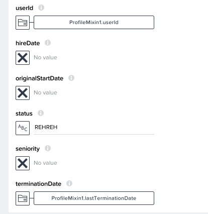
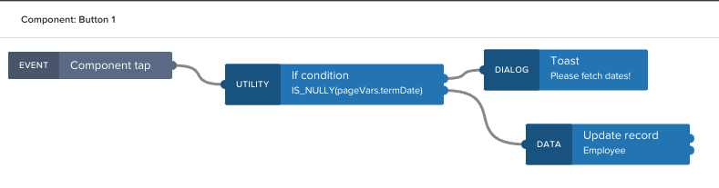

## Model logic with SAP AppGyver no-code features

In this section you will connect navigation between the 2 pages so that the selected Employee ID is passed to the detail page. You will also configure the on click events for the buttons on the detail page.

### Configure navigation

  1. Return to the **1. Exception List** page and select the image list item. Expand the logic panel at the bottom of the screen
  1. Drag the Open page component from the logic panel in the bottom left into the panel containing the component tap event
  1. Select the navigation event and set the Page to **2. Exception Details**
  1. Click the X below **EmployeeID** > Data item in repeat > current.ID
  1. Finally, click and connect the event node to the navigation node so the result looks like this:

     

  1. It may be necessary to also reset the click events of the Image List Component. To do so, double-click one of the rows to access edit mode
  1. Click Cell 1, select the trigger node, and set the triggered event to **Component tap**
  1. Repeat for Cells 2-4

     

  1. Switch to **2. Exception Details** and set a navigation event on the home icon back to the previous page

     

### Configure button "on tap" events

  1. From **2. Exception Details** click Variables > Page Variables and create 2 variables called seniorityDate and termDate. These will be used to populate the fields from SAP SuccessFactors when the ***Fetch Dates*** button is clicked.
  1. Set both variables to type text and set an example value like 2021-10-31

     

  2. Set the variable value type settings to initialize with undefined value

     

  3. Click View and set the Content value for the Title components in **Last Termination Date** and **Seniority Date** to the respective page variables

     

  4. Select the ***Fetch Dates*** button and add 2 **Set page variable** logic components on the canvas
     - Set the variable names to termDate and seniorityDate
     - Set the assigned value to a formula with the syntax ```SUBSTRING(data.EmployeeProfile1.lastTerminationDate, 0, 10)``` and ```SUBSTRING(data.EmployeeProfile1.seniorityDate, 0, 10)```

       

### Configure button to update employee record

  1. Now you will configure the **Submit** button to send a PATCH request to the CAP service running on SAP BTP. Click the **Submit** button and modify its logic
  1. Add an **If Condition** to the canvas
     - Set the condition to a formula with the syntax ```IS_NULLY(pageVars.termDate)```
     - This will ensure the **Fetch Dates** button is clicked before submitting the update
  1. Add a **Toast dialog** to the canvas
     - Set the toast message to **Please fetch dates!** to notify the user
  1. Add an **Update record** to the canvas
     - Set the resource name to the **Employee** data resource
     - Bind the identifier to the **EmployeeID** page parameter

       

     - Set the userId, status, and terminationDate fields as follows:

       

  1. Connect the logic components as below:

     

The application is finished and you are ready to test the end to end result!
