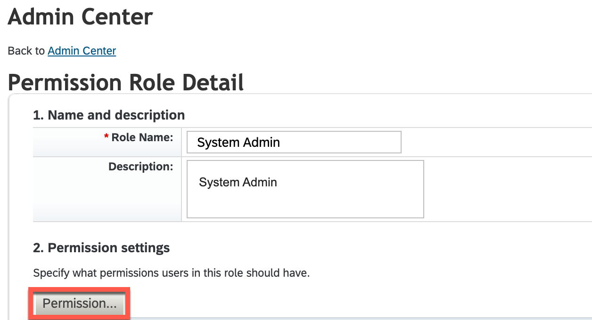
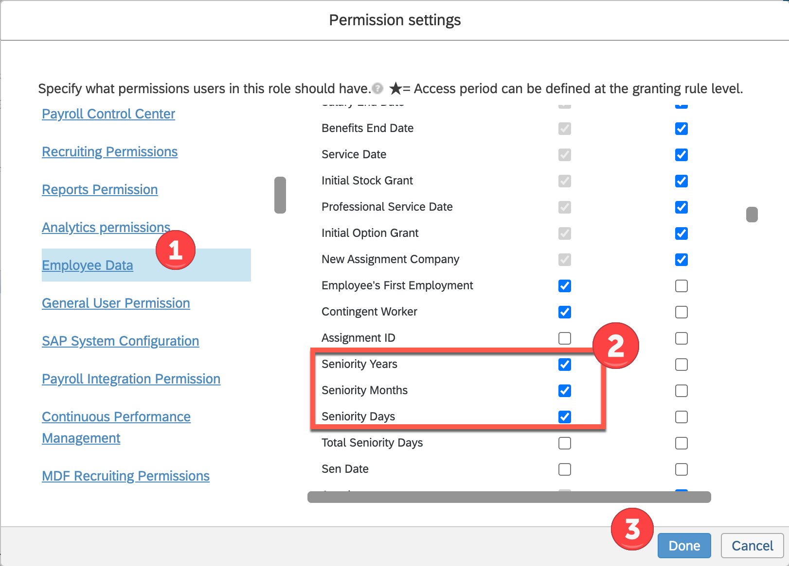

# Configure custom Seniority Fields in SAP SuccessFactors

In this step, you will create custom fields for the seniority in SAP SuccessFactors. After this part is done, we confirm the events and fields are active and ready for consumption.

## Extend the employmentInfo element with custom fields

1. Open the SAP SuccessFactors Dashboard and navigate to the <code>Admin Center</code>

  

2. Search for <code>Manage Business Configuration</code> and click on <code>employmentInfo</code> in the list of HRIS Elements. Scroll down to add custom fields. You will be able to click on an empty text box which says <code>No Selection</code> and choose the type of custom field you want to create (string, long, double, etc.).

  

2. Provide the labels and set the required parameters for this field like shown in the image below:
  - **Enabled** - <code>Yes</code>
  - **Mandatory** - <code>No</code>
  - **Data Type** - <code>STRING</code>
  - **Visibility** - <code>Edit</code>
  
  
  
3. Repeat this step to create fields with the following identifiers and labels:
  - **custom-string1** - <code>Seniority Years</code>
  - **custom-string2** - <code>Seniority Months</code>
  - **custom-string3** - <code>Seniority Days</code>
  - **custom-string4** - <code>Total Seniority Days</code>

4. Save your changes to the <code>employmentInfo</code> element before continuing.

5. If you get an error regarding ```isContingentWorker``` make sure its Visibility is set to ```View``` and Allow Import is set to ```Yes```

 

## Confirm events are active on jobInfo element

 1. Navigate to the <code>jobInfo</code> element still within <code>Manage Business Configuration</code>

 2. Scroll to the <code>Trigger Rules</code> section and confirm that **EVENT TERMINATION**, **EVENT_REHIRE**, and **EVENT_NEWHIRE** are set to **Event Type** <code>onPostSave</code>

  

  Update or add the event values (if they are missing) and save, if required.

## Check OData API Data Dictionary

 1. Access the <code>OData API Data Dictionary</code> from the search menu

  

 2. Enter <code>EmpEmployment</code> in the search window and select it from the result list.

  

 3. Note the technical label <code>custom-string4</code> has been modified to the OData compliant <code>customString4</code>. This is how you will access it during the write back from the extension.

  

## Configure UI permissions for custom fields

 1. Access ```Manage Permission Roles``` from the search window

  

 2. Search for ```System Admin``` role and select it from the table

 3. Click ```Permission...``` under ```Permission Settings```

  

 4. Select ```Employee Data```, scroll to ```Employment Details```, and add View permission to the seniority fields. Click done to finish.

  
 
 5. Select ```Save Changes```
 
This completes the custom seniority field creation process. 