## End to end test from SAP AppGyver to SAP SuccessFactors

In this step, we will execute a rehire in SAP SuccessFactors using the sample BestRun company data. The business event will be sent to SAP BTP, and marked as an exception when the previous termination date is not available in the SAP HANA Cloud persistence.

The HR business partner will see the exception surfaced in the SAP AppGyver application, remediate it with info from Employee Central, and the updated record is ultimately written back, with the seniority custom fields fully populated.

### Rehire employee in SAP SuccessFactors

There are a number of inactive employees in the BestRun company data, but most of them have been marked as not ok to rehire. The following section shows you how to interactively rehire an employee so that it triggers an intelligent service center job and can be worked with in the mobile app. If you don't have an SAP SuccessFactors tenant, you can utilize the requests in the request.http file in the repo to simulate all events.

1. Login to SAP SuccessFactors Employee Central as the **sfadmin** account
1. Search for rehire in the search bar and select **Rehire Inactive Employee**
    
    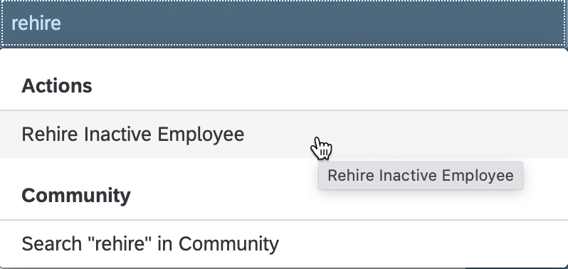

1. Select an employee from the list and rehire employee

    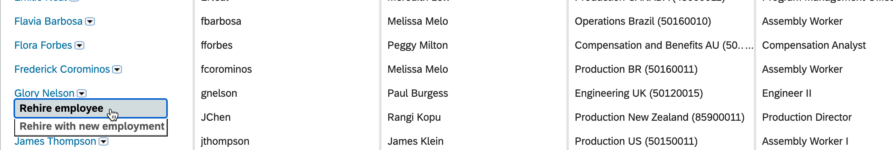

1. You may get the following error, in which case you need to edit the employee details first

    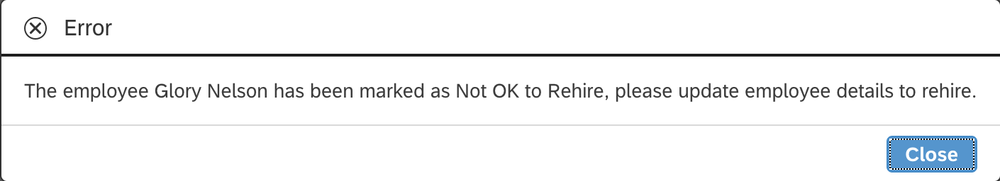

1. Type the employee name into the search bar and click on the inactive record

    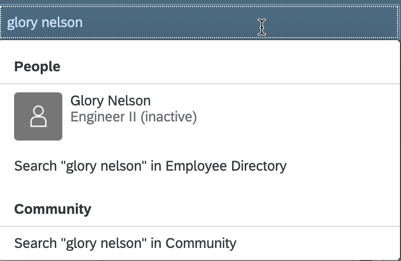

1. Click Employment Details from the dropdown

    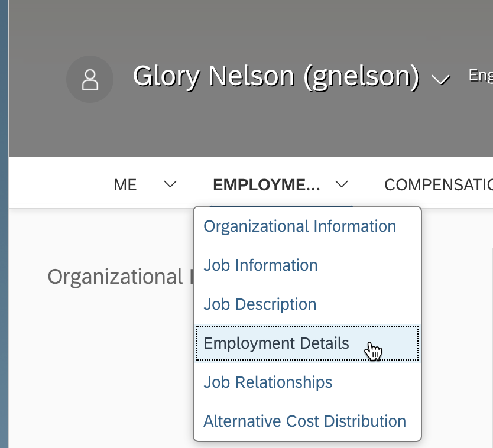

1. Click edit, update the OK to Rehire field to yes, and save

    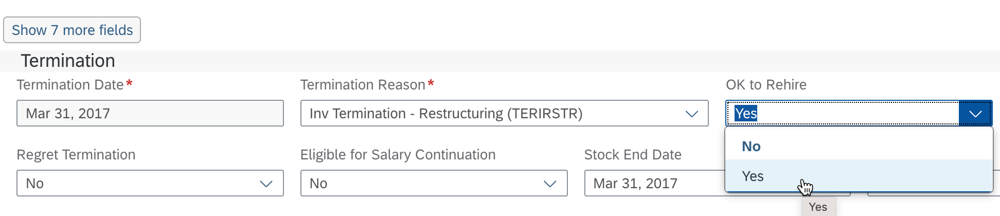

1. While you are in the profile, add a stock photo if one doesn't exist already

    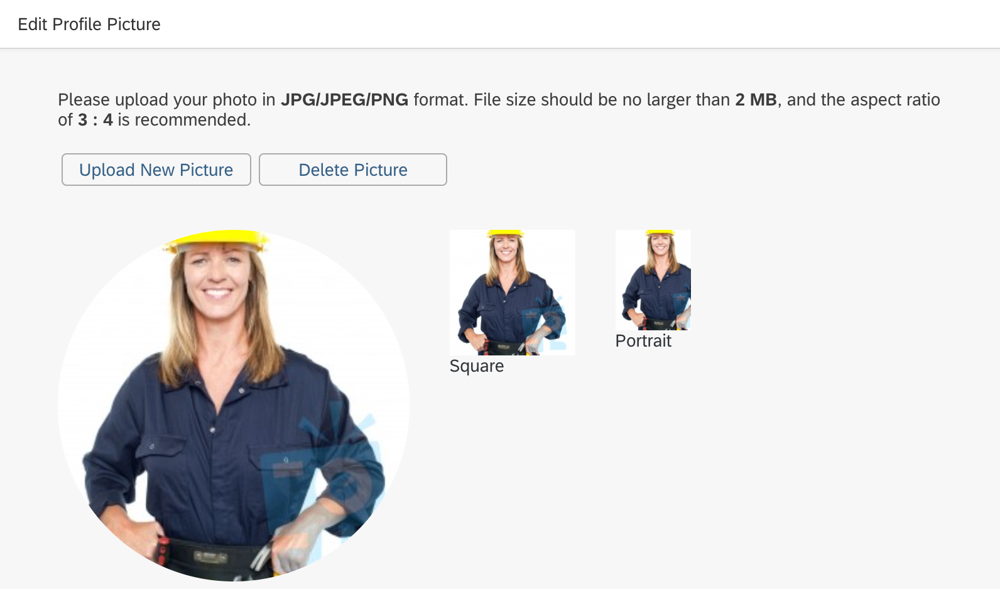

1. Rehire the employee again and set the event reason to REHREH

    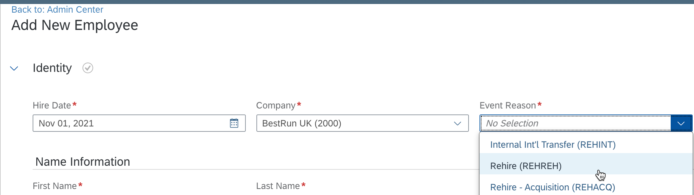

1. Continue and select a position for the rehired employee

    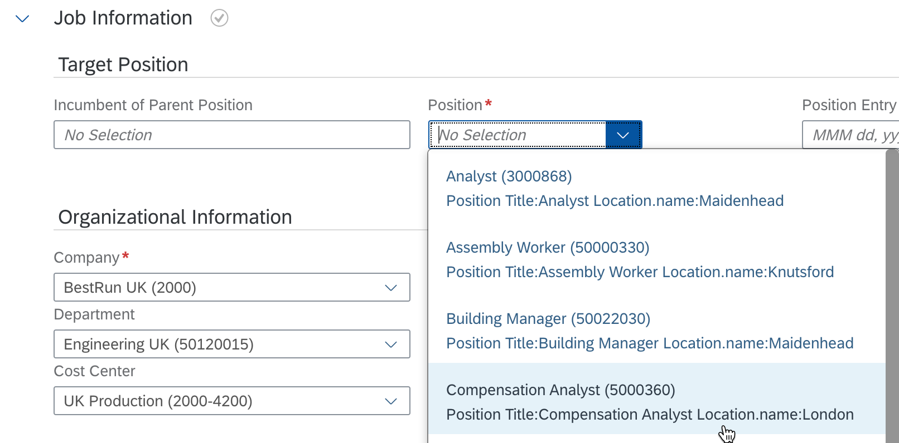

1. Select a pay group from the country in which you are rehiring. Continue or submit the rehire form.

    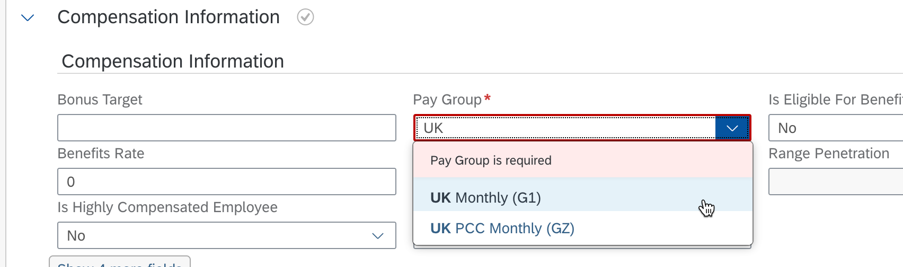

### Check the event message in SAP BTP cockpit

If you cloned the GitHub repo as-is, you should now have a console log message in the application logs running on SAP BTP.

1. Access the Cloud Foundry space where the CAP services are deployed and click applications
1. Click the seniority-calc-appgyver-srv application and select Logs
1. Look for a log message that confirms the event was triggered and picked up by CAP

    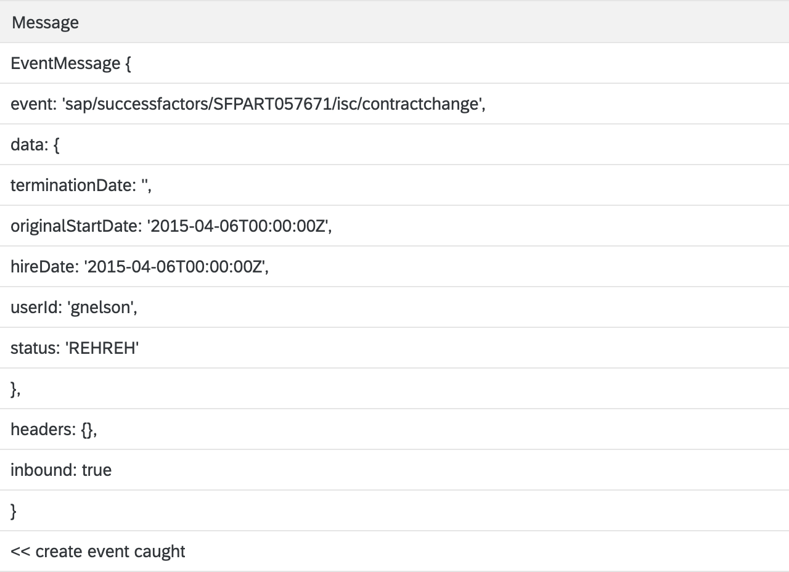

1. This is also where you would see any exception that might have occurred

### Finish the testing in SAP AppGyver

Now that the exception record has been created, we can remediate it in SAP AppGyver

1. Launch your SAP AppGyver application in the preview portal or from its deployed location
1. Confirm that there are employee records showing up under the exceptions page and select your rehired employee

    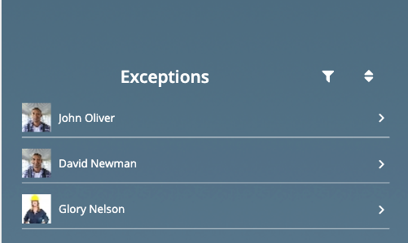

1. Click **Fetch Dates** and confirm the last termination date and seniority date are populated
1. Click **Submit** to push the records back into the extension endpoint

    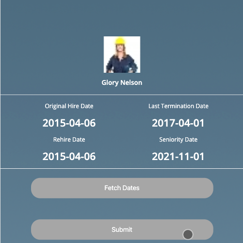

1. Finally, refreshing the employment details in SAP SuccessFactors shows the custom seniority fields have been populated

    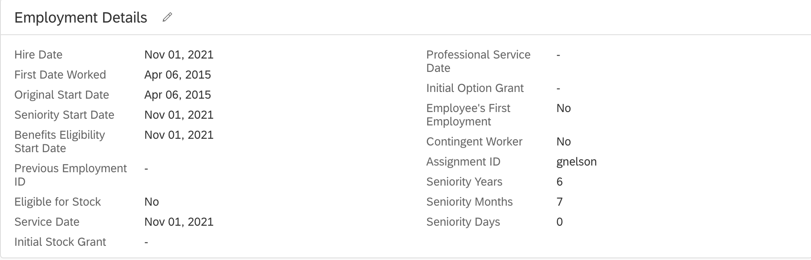

Congratulations on completing the end to end test of this use case!