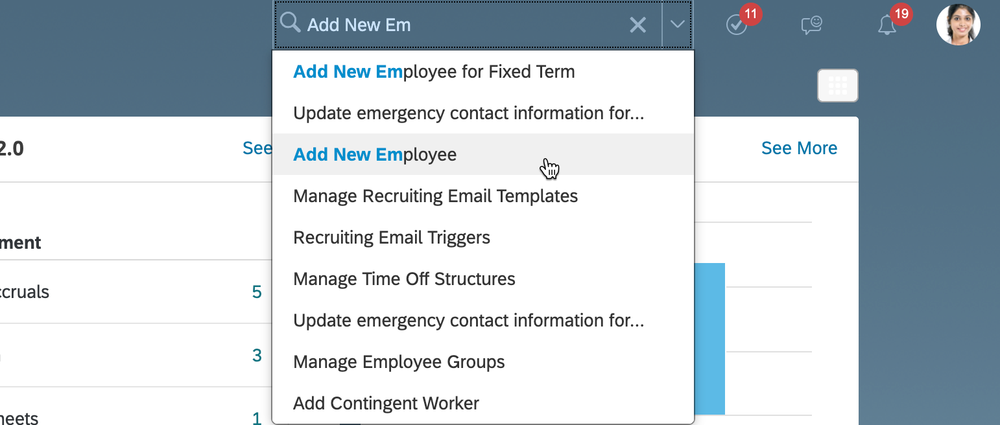
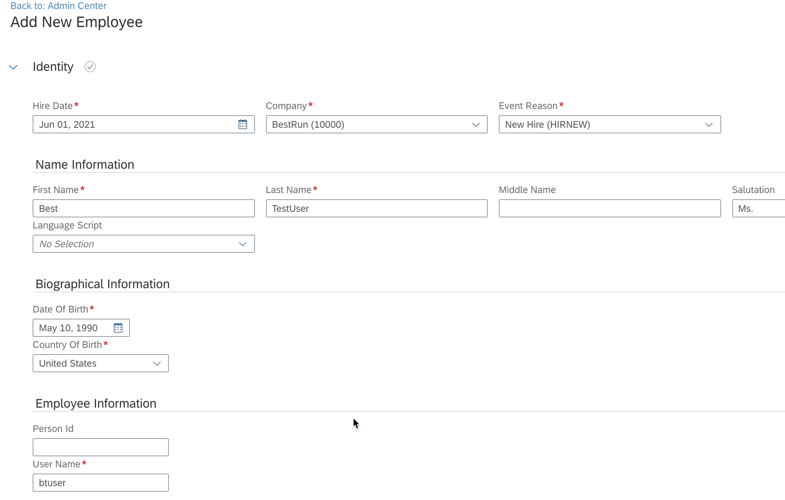
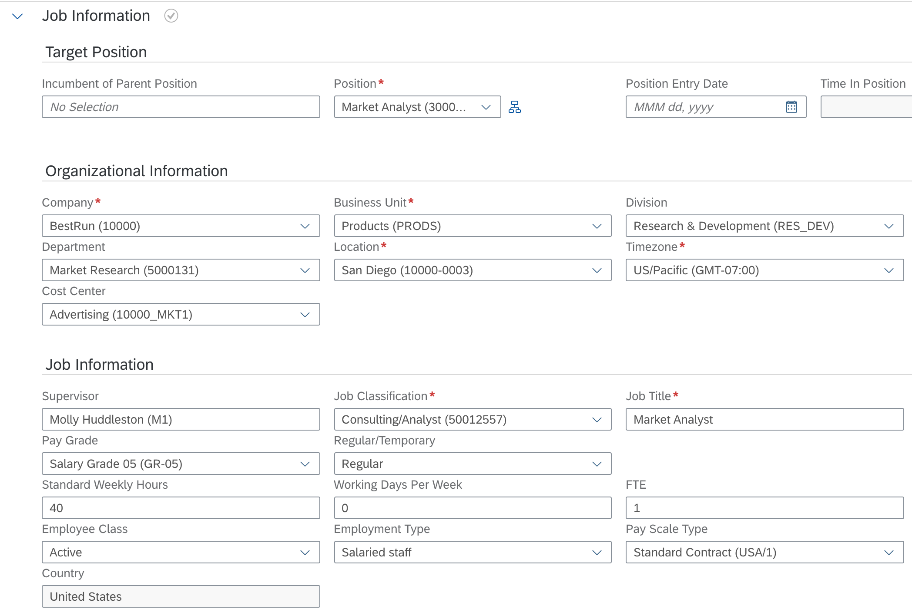
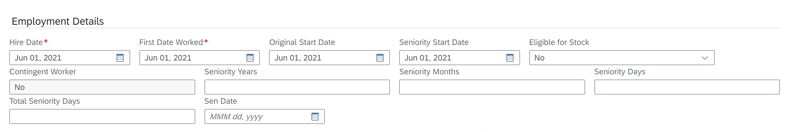
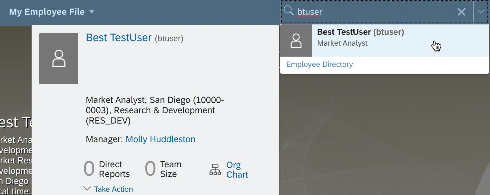
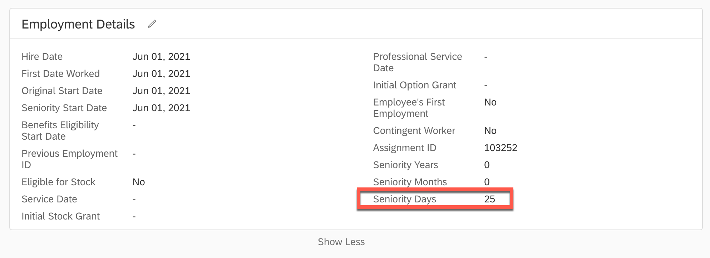
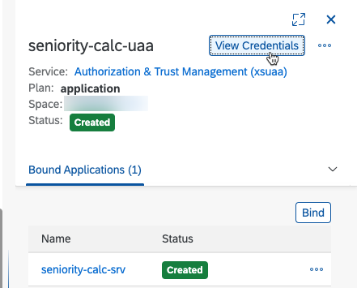
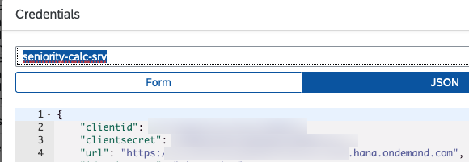
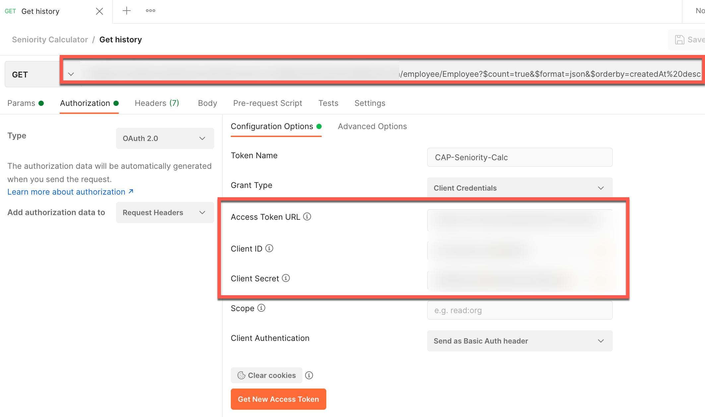
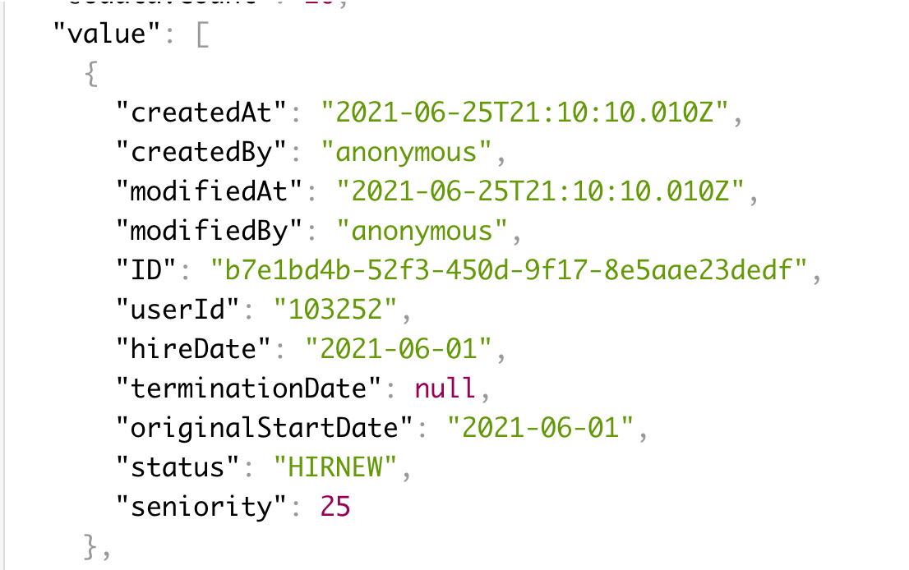

# Test end to end from SAP SuccessFactors to BTP CAP application

 If you made it this far, this step is where it all comes together. Here, we will hire a new employee in SuccessFactors, confirm the seniority is written back, and access the CAP endpoint on the BTP to check the history record.

 The same process works for an employee whose employment is terminated, as well as a rehired employee, but the extension logic assumes the employee's history is present in the CDS entity. For a productive use case, it would be advisable to initially replicate records for all current employees to the extension. Furthermore, some scheduling of the extension to regularly update seniority values might also be necessary.

## Hiring a new employee

 1. Login to SAP SuccessFactors as an administrator, enter <code>Add New Employee</code> in the search bar, and select the relevant option.

  

 2. Fill out the minimum required fields to define the new employee:

   -  <code>Hire Date</code>
   -  <code>Company</code>
   -  <code>Event Reason</code>
   -  <code>First Name</code>
   -  <code>Last Name</code>
   -  <code>Date of Birth</code>
   -  <code>User Name</code>

  

 3. Continue to <code>Job Information</code> and select a **Position**. Many other required fields will autocomplete once you do so.

  

 4. Continue to <code>Employment Details</code> and select a **Hire Date** and **First Date Worked**. Select a past date to see the seniority calculation impact immediately. Note that you can see the custom fields here in the UI as well.

  

 5. Confirm any remaining menus and submit the new hire.

## Check the results of the extension

 1. Navigate to the employee's record via the direct link, or type the username into the search bar to access.

  

2. Scroll down to <code>Employment Details</code> > **Show More** to check the seniority. In this case, I performed the new hire step on June 25, and set the hire date to June 1. The extension has returned a value of 25 days seniority.

  

3. Now we will check the CDS service in the BTP to confirm the record has been created. Import the [Postman collection](./Seniority_Calculator.postman_collection.json) and customize the request variables to match the UAA credentials in your environment. The CDS application should already be bound as part of the deployment process.

  

  

4. Customize the OAuth properties in the **Get history** of the Postman collection using the values retrieved in the previous step.

  

5. The response should look something like the below.

  

6. You can also add new entries or push an event into the message queue using the relevant Postman requests in the collection. Note that for the event mesh you need to use the properties you retrieved from the service key during the [Configure events on SAP SuccessFactors](../06-ConfigureEventsOnSAPSuccessFactors) section but topic names do not need to be double encoded.

Now you can proceed with the final steps of the mission!
