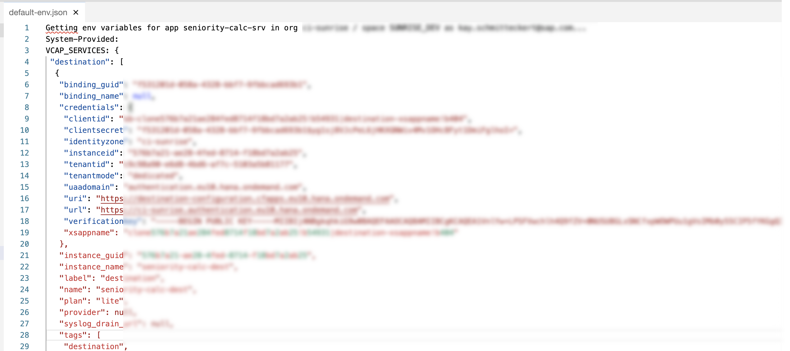
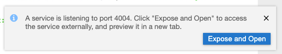

# Run CAP Application in SAP Business Application Studio

You will now enrich the default environment of your SAP Business Application Studio dev space with credentials of deployed services you deployed on Cloud Foundry. Once this step is done, you are able to run the CAP Application locally in your SAP Business Application Studio dev space to implement further logic and to debug.

1. To run the CAP Application locally in your SAP Business Application Studio dev space we need to provide environment variables to our CAP Application. Execute ```$ cf apps``` in the terminal of SAP Business Application studio to get a list of all applications.

2. Copy the name of the CAP Application for the seniority calculator and execute ```$ cf env <NAME-OF-THE-CAP-APPLICATION> > default-env.json```. This will create a file ```default-env.json``` with the following content:



3. Now format the file ```default-env.json``` to a valid JSON file which follows this structure:

```json
{
    "VCAP_SERVICES": {
        "...": "..."
    },
    "VCAP_APPLICATION": {
        "...": "..."
    }
}
```

4. Run the application locally in your SAP Business Application Studio environment by executing the following command in the root directory of your project in the terminal:

    ```
    cds watch
    ```

    Click on `Expose and Open` in the appearing PopUp. 

    

    The CAP application is now running locally in the dev space and attached to the services running on your Cloud Foundry environment.