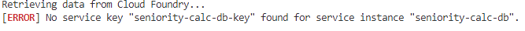

# Run CAP Application in SAP Business Application Studio

You will now enrich the default environment of your SAP Business Application Studio dev space with credentials of deployed services you deployed on Cloud Foundry. Once this step is done, you are able to run the CAP Application locally in your SAP Business Application Studio dev space to implement further logic and to debug.

1. To run the CAP Application locally in your SAP Business Application Studio dev space, we need to provide environment variables to our CAP Application. Execute the command
    ```$ cds bind -2 seniority-calc-db,seniority-calc-uaa,seniority-calc-em,seniority-calc-dest,eniority-calc-sfsf-service ``` 
in the root directory of your project in the terminal of SAP Business Application studio.


    > NOTE: The captured image showcases the command for running a mock service locally, so seniority-calc-sfsf-service is not specified. Add it to the command if a real SAP SuccessFactors system is used.
2. If there is an error as below

    

    Please navigate to instances and subscriptions in SAP BTP cockpit and create keys for all the dependent services, as shown below

    

    for example: if you need to create a service key for the seniority-calc-db service, name it seniority-calc-db-key (append -key to the name of service)

3. Run the application locally in your SAP Business Application Studio environment by executing the following command in the root directory of your project in the terminal:

    ```
    cds watch --profile hybrid
    ```

    Click on `Expose and Open` in the appearing PopUp. 

    

    The CAP application is now running locally in the dev space and attached to the services running on your Cloud Foundry environment.