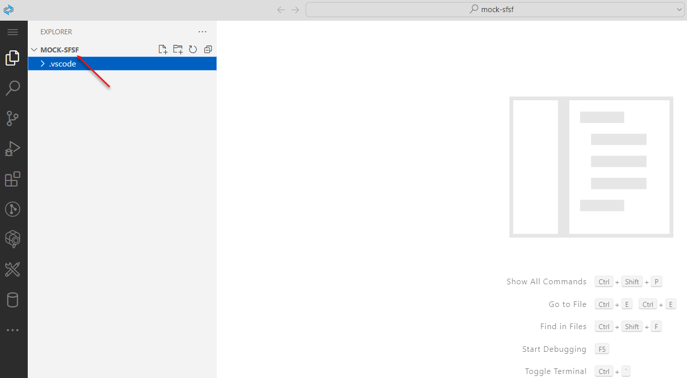
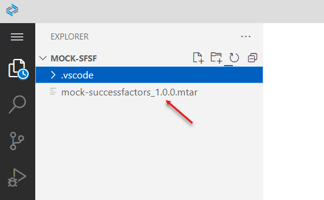

## Deploying Mock SuccessFactors Application ##
1. Logon to SAP Business Application Studion from SAP BTP.
2. Clone from github repository
```cd projects && git clone https://github.com/SAP-samples/successfactors-extension-calculate-employee-seniority.git -b mock-sfsf```

3. open the projects folder.
4. open terminal and build the project using ``` mbt build```
5. Deploy the application to subaccount using ```cf deploy mta_archives/mock-successfactors_1.0.0.mtar ```
6. This should successfully deploy the application. Please note down the application url.

## Testing the Mock SuccessFactors application along with SAP Appgyver ##

1. There are 10 mock users that are setup to test the mock scenario. user ids are 

| userId | userName         |
|--------|------------------|
| 00001  | Zimbelman Miller | 
| 00002  | Youard Mitchell  |
| 00003  | Youngblood Haugen|
| 00004  | Zerbe Clarke     |
| 00005  | Zobel Walker     |
| 00006  | Zimble Magnusson |
| 00007  | Zorn Watson      |
| 00008  | Yerkes Eriksson  |
| 00009  | Zacherl Jensen   |
| 00010  | Yandell Hansen   |


2. To test the users find the request.http file present at ```https://github.com/SAP-samples/successfactors-extension-calculate-employee-seniority/blob/sfsf-mobile-appgyver/srv/request.http```

3. there are three requests present as shown in the image below

4. change the @mockSfsfBtpEndPoint( application url noted after deploying the application it should be in the format **application url**/odata/v2) and @username (options from step 1).

5. Now Send both POST request and PATCH request. this should create a user with exception that is showcased in SAP Appgyver application.

6. Now Log into Appgyver application to follow the normal testing. this should update the custom fields in Mock SuccessFactors Application.

7. Lastly to check if the custom fields are updated Send the GET request from request.http file. it should show all the custom fields are updated.
