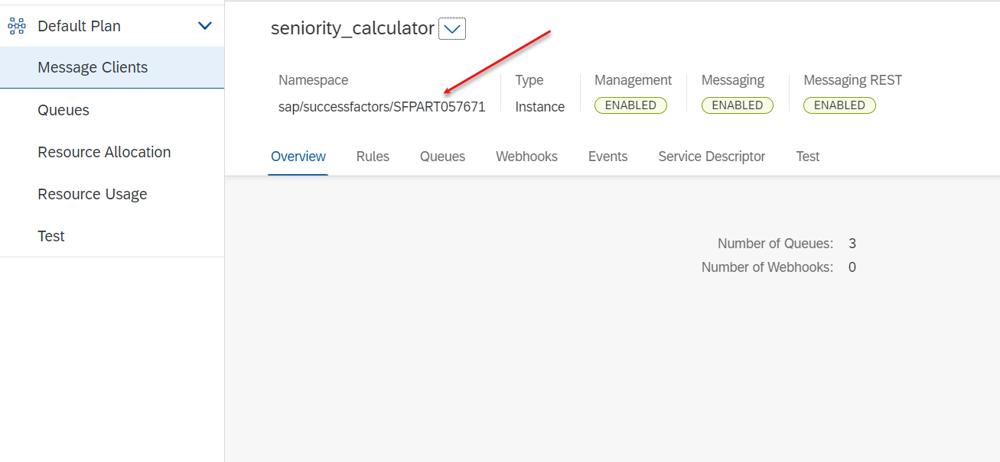

# Deploy CAP service to Cloud Foundry and HANA Cloud

In this how to guide, you will deploy the CAP Application with all its bound services as a Multi Target Application (MTA) from SAP Business Application Studio to Cloud Foundry and HANA Cloud.

1. Logon to the SAP BTP, Cloud Foundry Runtime. 

    - Click on **View > Find Command** in the menu on the top.  
   
      
    - Search for **Login to Cloud Foundry** and press **Enter** to confirm.  
      

    - Copy & Paste the API Endpoint of your subaccount from the SAP BTP Cockpit.   
      
 
    - Follow the process by entering the credentials of your SAP BTP account and by selecting the Cloud Foundry org and space you want to deploy the application to.

2. Install dependencies and update npm libraries

    ```
    npm install
    npm update
    ```
    
3. Mock service is used insted of SAP SuccessFactors so please remove the **sap-successfactors-extensibility** service specified in mta.yaml of Application.   
  
  

    Build the Multi-Target Application Archive (MTA Archive) by executing the following command in the root directory of your project in the terminal:

    ```
    mbt build
    ```

 
4. Deploy the application to SAP BTP, Cloud Foundry Runtime by executing the following command in the root directory of your project in the terminal:

    ```
    cf deploy mta_archives/seniority-calc_1.0.0.mtar
    ```

    This will trigger the deployment to SAP BTP, Cloud Foundry Runtime including the creation of the necessary service instances and service bindings to the corresponding apps.

## Redeployment
If you want to redeploy without undeploying the running CAP Application, you need to change a few services in the ```mta.yaml``` from ```managed-service``` to ```existing-service```. For this, adjust the marked lines highlighted [here](https://github.com/SAP-samples/successfactors-extension-calculate-employee-seniority/blob/main/mta.yaml#L49-L50) and [here](https://github.com/SAP-samples/successfactors-extension-calculate-employee-seniority/blob/main/mta.yaml#L61-L62) that it looks like the following:

```yaml
  - name: seniority-calc-em
    #type: org.cloudfoundry.managed-service
    type: org.cloudfoundry.existing-service
```


# Deploy Mock service to Cloud Foundry
Please skip this step if real SAP SuccessFactors is utilized and continue with the [Next Step](#deploy-cap-service-to-cloud-foundry-and-hana-cloud). If you don't have a real SAP SuccessFactors, then use the mock service provided. Follow the steps to deploy mock service.
#### Deploy mtar file
1. Download the .mtar file from [Mock service **.mtar** file](https://github.com/SAP-samples/successfactors-extension-calculate-employee-seniority/raw/mission/11-MockSfsfDeployment/mock/mock-successfactors_1.0.0.mtar)
2. Login to SAP Business Application studio and open an Empty folder.     

     

3. Drag and Drop the Downloaded mtar file into the workspace.     

      

4. Get the cloud foundry API endpoint from SAP BTP cockpit.    

        

5. Open terminal and login using below command     
        ```cf login -a <API Endpoint>```    

6. Deploy the **mock-successfactors_1.0.0.mtar** file using command    
    ```cf deploy mock-successfactors_1.0.0.mtar```    

7. Now the mock service is deployed successfully, note down the Application URL.   

8. A user-provided variable(messaging client URL) is created in the SAP BTP cockpit, as shown below after successful deployment. If the namespace in **em.json** of the Seniority calculator application is updated, please change it here and restart the service.

       

9. Here the namespace of SAP Event Mesh is <code>sap/successfactors/SFPART057671</code>. If the namespace is changed, please get it from SAP Event Mesh Service as shown below.

    

> **Note:** This namespace will only be available after deploying the seniority calculator application. It can also be fetched from **em.json** of the seniority calculator application.
#### Creating a destination in SAP BTP cockpit
1. Login to SAP BTP cockpit and navigate to **Connectivity > Destinations** in the navigation pane.      
  
2. Click on New Destination.         
  
3. Complete the Destination with below values

    | Field | Value         |
    |--------|------------------|
    | Name  | seniority-calc-sfsf-service | 
    | Type  | HTTP  |
    | Description  | Destination to connect to mock service. |
    | URL  | URL from Step 6    |
    | Proxy Type  | Internet     |
    | Authentication  | NoAuthentication |

Now the  SAP SuccessFactors mock service is successfully set up. Please continue with the following steps to deploy the seniority-calculator application.

