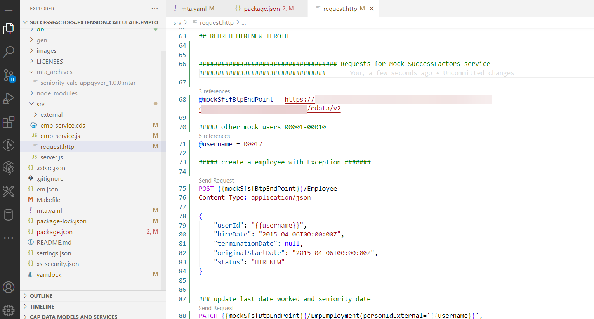
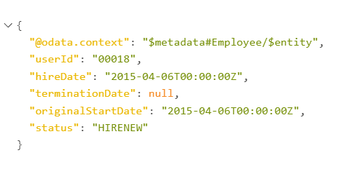
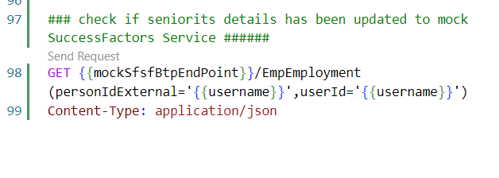
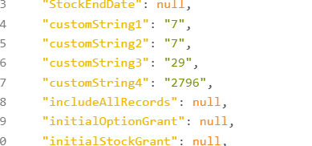

# Test end to end from Mock service to BTP CAP application

If you made it this far, this step is where it all comes together. Here, we will hire a new employee in mock service, confirm the seniority is written back, and access the CAP endpoint on the BTP to check the history record.

The same process works for an employee whose employment is terminated, as well as a rehired employee, but the extension logic assumes the employee's history is present in the CDS entity. For a productive use case, it would be advisable to initially replicate records for all current employees to the extension. Furthermore, some scheduling of the extension to regularly update seniority values might also be necessary.

## Hiring a new employee

1. Open the request.http file present in srv folder of Application

2. Send Post request After editing the <code>mockSfsfBtpEndpoint</code> and <code>username</code>. 
  > Note:There are 10 mock users that are already created username ranging from 00001-00010. Feel free to utilize one of those Ids as the data is already setup.

  > Note: Status should be "HIRENEW" for new Hires and "REHREH" for Rehire.

Response should be as below:

3. After successfully sending the POST request, seniority calculator application updates the EmpEmployment Entity with seniority details. To check the ouput utilize the GET request as shown below.

4. After successfully sending the GET request the response should showcase the updated entity with Seniority calculations as below.
  

If you reached this point then the mock application and seniority calculator application are setup and tested successfully.