# Kyma Observability in CAP Application

## Description

Monitor metrics, traces and telemetry data of your CAP application. Visualize Application data using Prometheus and Grafana components in Kyma Runtime and set alerting rules for high HTTP latency request and traffic exceeding a threshold to send message to client apps like Slack, PagerDuty, and Microsoft Teams for quick action.


__Current Situation - What is the challenge ?__

Service administrators/Developers often want to monitor business critical CAP services, visualize telemetry metrics, and get notified on monitoring signals like High Latency Request and Number of requests made to the service. Monitoring continuously is very time consuming and always leaves room for human errors.

__Destination - What is the outcome?__

Visualize telemetry metrics and get notified instantly on messaging clients based on alerting rules pointing to one or multiple services based on admin's need.

__How You Get There - What is the solution?__

Receive alerting messages on Slack app based on high request latency and the high traffic received by different service endpoints.


## Solution Diagram
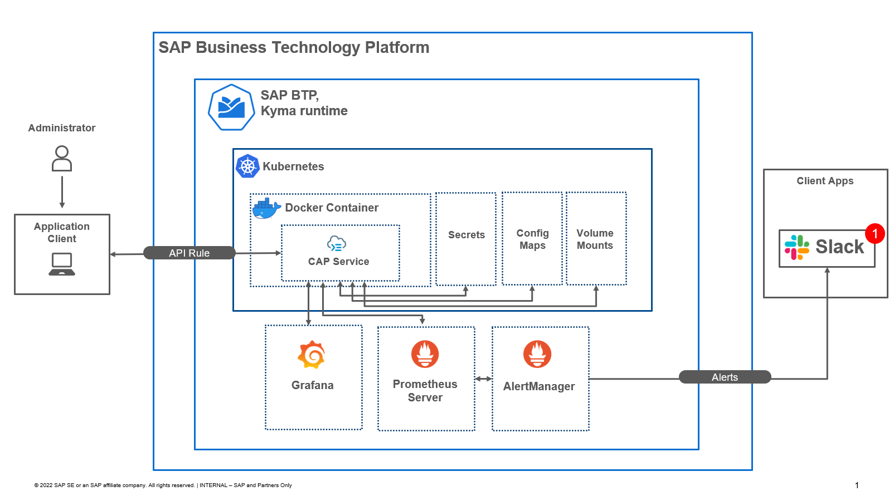

An existing SAP Cloud Application Programming Model (CAP) [successfactors-extension-calculate-employee-seniority](https://github.com/SAP-samples/successfactors-extension-calculate-employee-seniority) is used to demonstrate this use case. This application is contanerized into a docker container which is managed by kubernetes environment in the Kyma runtime. An unrestricted API rule is then applied to make the CAP app accessible on the internet. Credentials needed by the application like SAP Hana credentials, SAP Event Mesh credentials are provided through Secrets, Config Maps, and VolumeMounts to the CAP application. Out of the box Grafana provided by Kyma runtime is configured to collect namespace as well as container detailed logs. Prometheus and Alertmanager custom components are deployed to collect metrics and send alerts to Slack App.

## Setup Instructions

### Prerequisite

- [SAP BTP Enterprise Account](https://help.sap.com/docs/BTP/65de2977205c403bbc107264b8eccf4b/56440ab2380041e092c29baf2893ef97.html?)
- SAP Business Application Studio/Microsoft Visual Studio Code
- [Kyma Environment Setup](https://help.sap.com/docs/BTP/65de2977205c403bbc107264b8eccf4b/d1abd18556f24fb091d081b2e3454b8b.html?)
- [Custom Identity Provider configuration for Kyma](https://help.sap.com/docs/BTP/65de2977205c403bbc107264b8eccf4b/67bcc6e2d4d749659faf3ede1853f19e.html)
- [Docker Hub Account](https://hub.docker.com/)
- [Docker Desktop](https://docs.docker.com/desktop/#download-and-install)
- [CDS Utility Installation](https://cap.cloud.sap/docs/get-started/#local-setup)
- [Kyma installation](https://kyma-project.io/docs/kyma/latest/02-get-started/)
    - [Kubectl](https://kubernetes.io/docs/tasks/tools/)
    - [K3d](https://k3d.io/v5.4.1/) (Could be used for local development but it is optional for this use case)
    - [Kyma CLI](https://kyma-project.io/docs/kyma/latest/04-operation-guides/operations/01-install-kyma-CLI/)
- [Create Service instances](https://help.sap.com/docs/BTP/65de2977205c403bbc107264b8eccf4b/0453ffbaad1b4352b801df2f8cabc0fa.html) and configure the [credentials](https://cap.cloud.sap/docs/node.js/cds-connect#env-service-bindings) 
- [Slack webhook configuration for your workSpace](https://api.slack.com/messaging/webhooks#create_a_webhook)

    
## Step-1: Kubectl configuration with Kyma

1. After completing the prerequisite, open SAP Business Application Studio or Microsoft Visual Studio Code to get the code of this use case by cloning this repository. Use command ``` git clone -b kyma-env  https://github.tools.sap/btp-use-case-factory/successfactors-appgyver-seniority-calc/```

2.  Download the __\<ClUSTER-NAME\>-kubeconfig.yml__ file from the kyma dashboard by clicking ```Clusters name > Clusters Overview```.

    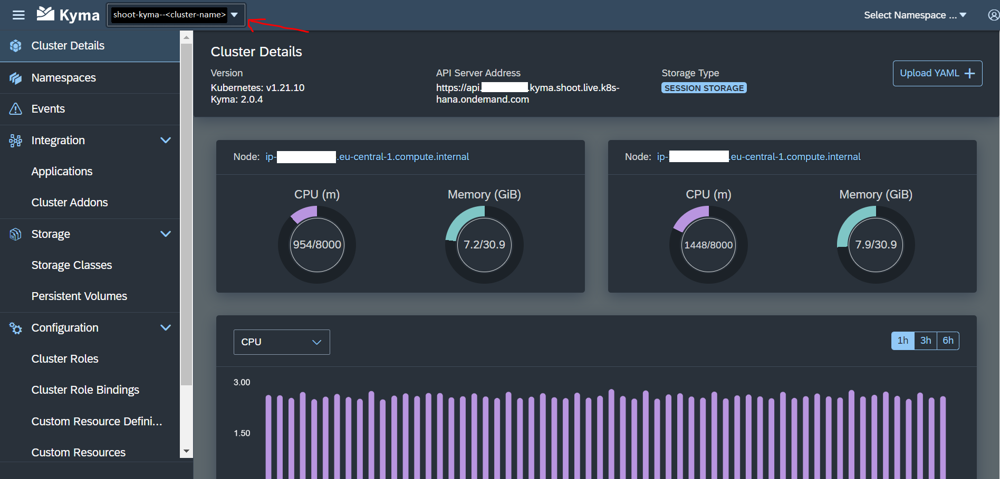
   
    Set the KUBECONFIG system environment variable using the following commands: 
  - Windows: ```set KUBECONFIG=.\kubeconfig.yml```
  - MacOS: ```export KUBECONFIG=.\kubeconfig.yml```

    Note: Prior to Kyma 2.0.4 version release the credentials in __kubeconfig.yml__ file use to expire every 8 hours, but with Kyma 2.0.4 version the credentials don't expire. So make sure to keep your credentials secured.

6. Check if kubectl was configured successfully with your account by using ```kubectl config get-contexts``` (This should return your cluster's information else something went wrong)


## Step-2: Build & Containerize CAP application

1. Use ``` cds build --production ``` command from the root of the cloned repository to build the cap application for production.

2. Next signin into your Docker Hub account from Docker Desktop.

3. Build a local docker image of the cap application by using command ``` docker build -t <USERNAME>/<IMAGENAME:TAG> -f ./docker/Dockerfile .``` from the root of the cloned repository.

4. After the build has completed successfully, push the docker image to your Docker Registry using command ``` docker push <USERNAME>/<IMAGENAME:TAG> ```.The username, image name and the tag name should be same as while building the image locally.

5. Next, make changes to the ```image``` property in the ```./cap-app-deployment/deployment.yaml ``` file by replacing your docker hub username and name of the pushed image. 

    *deployment.yaml*

        spec:               
          containers: 
            # Please replace your account username and name of the image pushed to docker hub
            - image: docker.io/<USERNAME>/<IMAGENAME:TAG> 
        ...

6. Before deploying our contanerize application, create a new namespace using command  ```kubectl create namespace seniority-calculator```. Create the deployment of the app in the kyma environment by using command ```kubectl create -f deployment.yaml -n seniority-calculator```

7. Finally, deploy the service for the cap application and expose over the internet bu creating an API rule.

    Use commands:

    Create Service: ``` kubectl create -f service.yaml -n seniority-calculator ```

    Create API Rule: ``` kubectl create -f apiRule.yaml -n seniority-calculator```

    If you want to validate the creation of the resources, head over to ```seniority-calculator``` namespace and navigate to Deployments, Services and API Rules from the left panel.

## Step-3: Deploy Prometheus Server and AlertManager Component

### Prometheus Server Deployment

  1. Change current directory using command ```cd ./component/prometheus```
  2. Make changes to the targets property by replacing the __seniority-calculator-service__ namespace name with __seniority-calculator__ namespace name then create ConfigMap to configure alerting rules, alertmanager and targets that will be used by the prometheus server using command ```kubectl create -f configMap.yaml -n seniority-calculator```.Take a closer look at the scrape_configs section where we have __cap_service_monitor__ job name, this points to the CAP application running on port 4004 for metrics collection.
  
      *configMap.yaml*
  
          prometheus.yml: |-
          global:
            scrape_interval: 5s
            evaluation_interval: 5s
          rule_files:
            - /etc/prometheus/prometheus.rules
          alerting:
            alertmanagers:
            - scheme: http
              static_configs:
              - targets:
                - "alertmanager.seniority-calculator.svc:9093"
          scrape_configs:
            - job_name: 'cap_service_monitor'
              scrape_interval: 5s
              static_configs:
                - targets: 
                  - <SENIORITY-CALCULTOR-SERVICE-CLUSTER-IP>:4004
            ...
          

  3. Next, deploy the __prometheus-server__ using command ```kubectl create -f deployment.yaml -n seniority-calculator```.For our deployment, we are using the official prometheus image from the prometheus's docker registry.

        *deployment.yaml*

          spec:
          containers:
            - name: prometheus
              image: docker.io/prom/prometheus:latest
          ...

  4. After deployment is successful, deploy the service which can serve our __prometheus-server__ deployment. We will be serving our service on port 9090. This also allows the scraping of our own prometheus-server deployment, so prometheus-server itself has a /metrics endpoint.

        *service.yaml*

          apiVersion: v1
          kind: Service
          metadata:
            name: prometheus-server-service
            annotations:
                prometheus.io/scrape: 'true'
                prometheus.io/port: '9090'
          ...

  5. Finally, we will expose the service to make it accessible over the internet. Use ``` kubectl create -f apiRule.yaml -n seniority-calculator``` to expose the service created in the previous step.


### AlertManager Component Deployment

  1. Change current directory using command ```cd ../alertmanager```

  2. Create the alerting templates config map using command ```kubectl create -f alertTemplateConfigMap.yaml -n seniority-calculator```. Notice how the templates with the html & css are defined in this file. You can also create your own templates with the html elements & css stylings to customize your alerts appearance.

  3. Create the AlertManager config map which consist of usage of templates defined in the alertTemplateConfigMap.yaml file and the slack app's channel config information. Use command ```kubectl create -f alertManagerConfigMap.yaml -n seniority-calculator```

  4. Create deployment for the alertmanager component using command ```kubectl create -f deployment.yaml -n seniority-calculator```. Notice how the ```volumeMounts``` label is used to point to config maps create in previous steps.

  5. Finally, create the service that serves the alertmanager deployment and expose it over the internet by creating an API rule.
      - Create Service: ```kubectl create -f service.yaml -n seniority-calculator```
      - Create API Rule: ```kubectl create -f apiRule.yaml -n seniority-calculator```


  Now, if you open your namespace(seniority-calculator) and navigate to ```Discover and Networ > API Rules```, you can see three API rules exposing alertmanager, prometheus-server and seniority-calculator-service in which you can click the Host URL to access these services.

  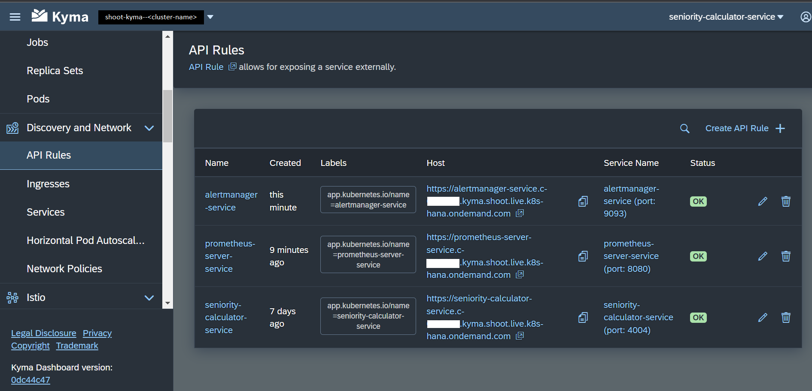

  __Note__: For demonstration of this use case, there is currently noop(no auth) access strategy applied for the API rule configured due to which the service is freely available over the internet.

## Step-4a: Getting prepared for testing

  1. Open all of the three Host URL in new tabs by navigating to your namespace(seniority-calculator) > Discovery and Network > API Rules. 

  2. The __seniority-calculator-service__ has all of the service endpoints defined by the cap application and also the /metrics endpoint that collects metrics for three READ handlers: EmpEmployment, Photo, and EmployeeProfile.

      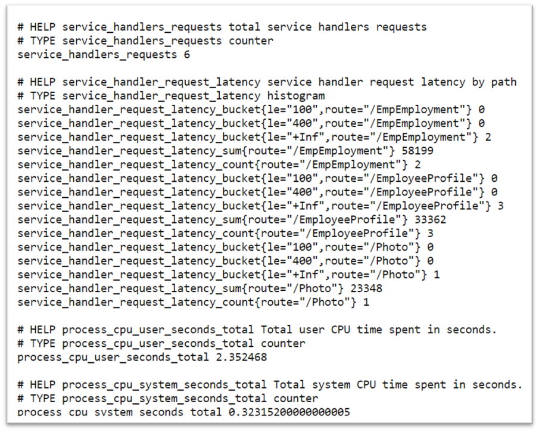
  
  3. The __prometheus-server-service__ can be used to view targets( to which our prometheus server is scraping metrics), view defined rules, alerts, visualize data on a graph using PromQL expression, etc.

      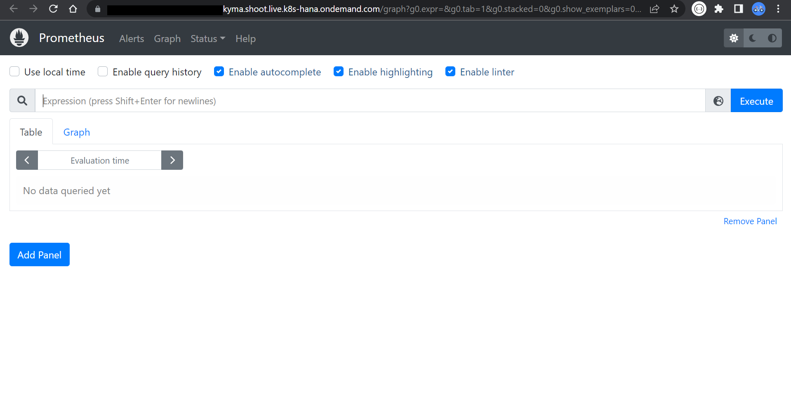

  4. The __alertmanager-service__ can be used to monitor active alerts, see grouping of alerts, view silenced alerts, etc.

      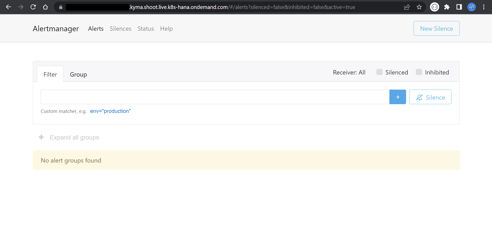

## Step-4b: End to End testing
  
1. Open ```/Photo``` endpoint of the __seniority-calculator-service__ and check the rules evaluation by using the alerts tab on the __prometheus-server-service__ APIRule. You will see that the __HighLatencyRequest-Photo-Route__ will change it's status from pending to firing after the scraping interval as 5 secs and rule evaluation interval is complete (i.e. 1 secs in our case)

    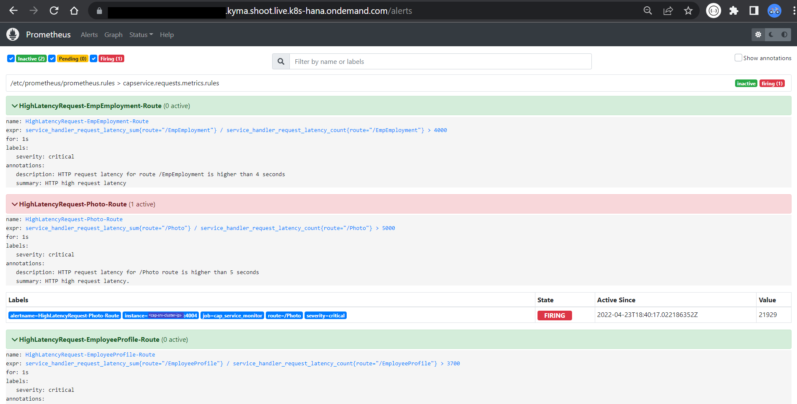

    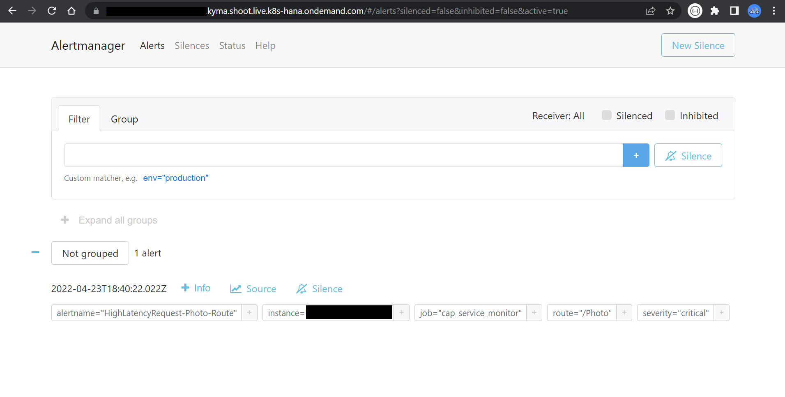

    Note: You might need to refresh the prometheus and alertmanager services to see changes in the alerts.

2. After the alertmanager shows the alert, an instant alert message will be sent to your configured slack channel with the details of the alert to take action.

    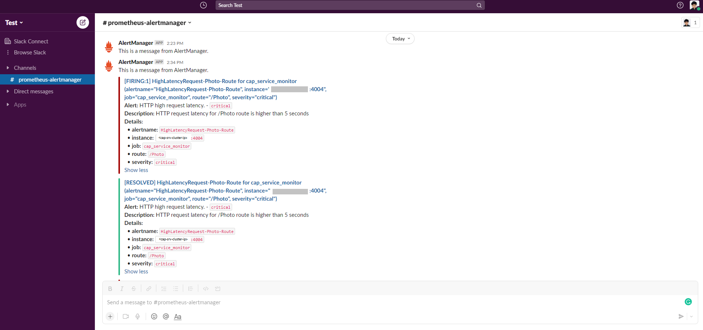

    Note: When the alert is firing and let's say the service was fixed and the rule for the /Photo route no longer holds true then the alertmanager will wait for 5 minutes to send a resolved message to the slack app but let's say the service latency was not fixed and the rule conitnuously evaluates to true then no resolved message will be sent until the alert's status changes to back to non-firing states(i.e. resolved state). You can simulate this scenario by restarting the __seniority-calculator-service__ deployment to reset all of the metrics on the metrics endpoint which will resolve the firing alerting rule.

    The __HighNumberOfRequests__ rule fires up when the number of request made to the service becomes greater than 60 in the last 1 minute. This helps to monitor the heavy load on the service and make necessary changes.

    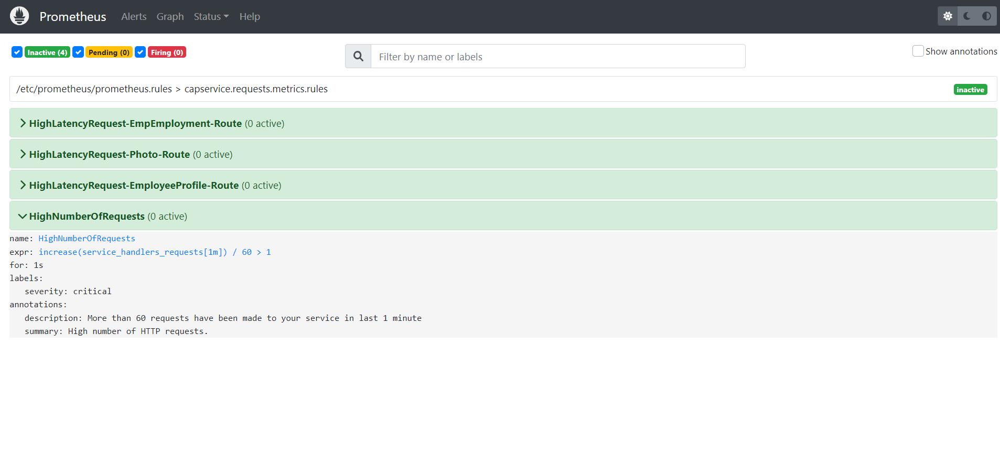

3. Open Grafana dashboard linked in the Kyma's cluster dashboard page and select loki as the logging system to view detailed logs collected from the __seniority-calculator-service__ for improved debugging experience. Use ```{container="seniority-calculator-service"} ``` to get container level logs or ```{namespace="seniority-calculator-service"} ``` to get namespace related logs.

    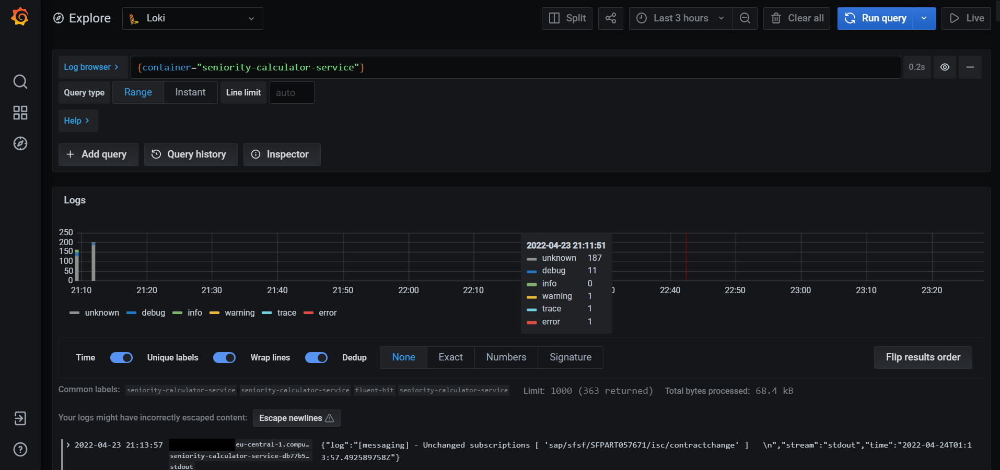

4. Navigate to the __prometheus-server-service__ and click the Graph tab at the topbar. Use ```service_handler_request_latency_sum{route="/EmployeeProfile"} / service_handler_request_latency_count{route="/EmployeeProfile"}``` as the PromQL expression which are parameters exposed by the __seniority-calculator-service__ metrics endpoint. Click the Graph tab and visualize the average latency metrics changing over time as you make request to the CAP app. 

    
    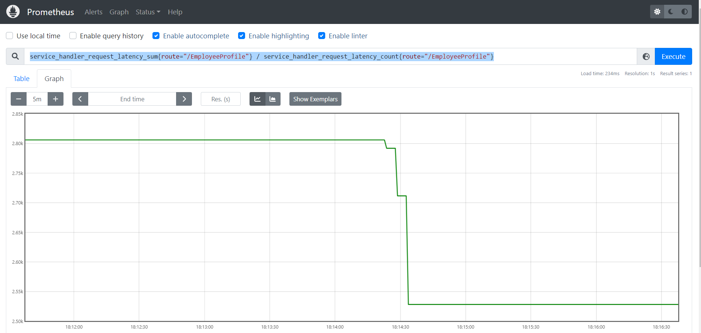

## Limitations

  Currently, there is some issue with the Kyma's native AlertManager component which doesn't listens to new alerts after the very first alert is resolved due to which I have to deploy my own Prometheus and AlertManager which doesn't takes advantage of other metrics exposed by the __kyma-system__ namespace.

## Debugging tips

- If you want to configure an existing resource use command ``` kubectl apply -f <FILENAME.yaml>```. Note that ```kubectl create -f <FILENAME.yaml>``` command is used to create the resource for the very first time.
- When you are using ```kubectl apply/create``` command without -n or --namespace flag then either the namespace defined with your YAML file will be used or default namespace will be used if no namespace is defined.
- You can always look for logs related to service deployments, pods and namespaces using the Grafana dashboard linked on the Kyma cluster dashboard page.

## Current Issues

  No known issues
